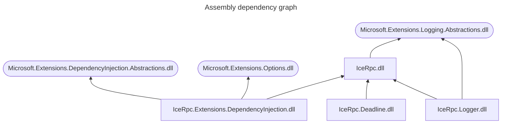

## DI as an optional feature

The first rule of DI is: don't introduce a dependency on DI.

IceRPC for C# takes this rule at heart by providing full support for DI while making this support completely optional.

The IceRPC C# API was designed to be both DI-friendly and DI container agnostic. Additionally, IceRPC provides support
code to help you use IceRPC with [Microsoft's DI container][microsoft-di-container].

## DI APIs

All the DI-related APIs provided by IceRPC are in the same namespace, [IceRpc.Extensions.DependencyInjection], but are
implemented by several assemblies:

- [IceRpc.dll] provides abstractions such as [IDispatcherBuilder] and [IInvokerBuilder] [IceRpc.Deadline.dll] and other
interceptor/middleware assemblies provide extension methods for `IDispatcherBuilder` and `IInvokerBuilder`. These
extension methods are DI container agnostic.
- [IceRpc.Extensions.DependencyInjection.dll] provides support code for Microsoft's DI container. This includes various
extension methods for [IServiceCollection], such as [AddIceRpcServer] and [AddIceRpcClientConnection], and
implementations for `IDispatcherBuilder` and `IInvokerBuilder`.

[microsoft-di-container]: https://learn.microsoft.com/en-us/dotnet/core/extensions/dependency-injection

[AddIceRpcServer]: csharp:IceRpc.Extensions.DependencyInjection.ServerServiceCollectionExtensions
[AddIceRpcClientConnection]: csharp:IceRpc.Extensions.DependencyInjection.ClientConnectionServiceCollectionExtensions
[IceRpc.Extensions.DependencyInjection]: csharp:IceRpc.Extensions.DependencyInjection
[IServiceCollection]: https://learn.microsoft.com/en-us/dotnet/api/microsoft.extensions.dependencyinjection.iservicecollection
[IDispatcherBuilder]: csharp:IceRpc.Extensions.DependencyInjection.IDispatcherBuilder
[IInvokerBuilder]: csharp:IceRpc.Extensions.DependencyInjection.IInvokerBuilder
[IceRpc.dll]: https://github.com/icerpc/icerpc-csharp/blob/0.3.x/src/IceRpc/README.md
[IceRpc.Deadline.dll]: https://github.com/icerpc/icerpc-csharp/blob/0.3.x/src/IceRpc.Deadline/README.md
[IceRpc.Extensions.DependencyInjection.dll]: https://github.com/icerpc/icerpc-csharp/blob/0.3.x/src/IceRpc.Extensions.DependencyInjection/README.md
