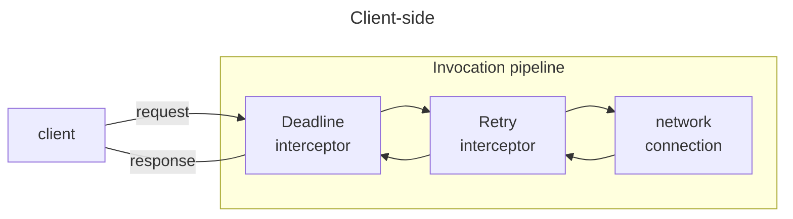
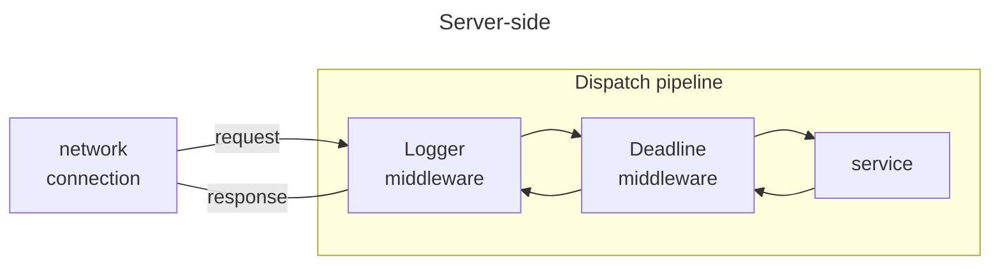

## RPC framework

Remote procedure call (RPC) is a fundamental paradigm for networked applications: a client sends a request to a server
over a network connection, the server processes this request and then sends back a response to the client over the same
connection.

An RPC framework like IceRPC helps you apply this paradigm to your own networked applications without reinventing the
wheel.

## Built for QUIC

IceRPC was built from the ground up to take advantage of [QUIC], the new multiplexed transport that underpins [HTTP/3].

QUIC is ideally suited for RPCs: an RPC maps to a request/response pair carried by a bidirectional QUIC stream.
Multiple request/response pairs can proceed in parallel inside the same QUIC connection without interfering with each
other.

IceRPC uses its own application protocol, [icerpc], to exchange connection settings, transmit requests and responses,
and ensure an orderly shutdown. This new RPC-focused protocol is a thin layer over QUIC.

### Not only for QUIC

The primary transport for IceRPC is QUIC, but we're still in the early days of QUIC, so being QUIC-only is not
practical.

To bridge this gap, IceRPC provides a multiplexing adapter called [Slic]. Slic implements a QUIC-like multiplexed
transport over any duplex transport such as TCP. This way, you can use IceRPC with QUIC, with TCP (via Slic), and with
various other traditional transports such as Bluetooth and named pipes.


Slic over TCP suffers from the same [head-of-line blocking][hol] issue as HTTP/2. QUIC was created in part to address
this issue.


## Modular and extensible

### Invocation and dispatch pipelines

When you make an RPC with IceRPC, your request and response travel through an invocation pipeline (on the client side)
and a dispatch pipeline (on the server side):

These pipelines intercept your requests and responses and you decide what they do with them. If you want to log your
requests and responses, add the Logger interceptor to your invocation pipeline or the Logger middleware to your dispatch
pipeline. If you want to retry automatically failed requests that can be retried, add the Retry interceptor to your
invocation pipeline. IceRPC provides a number of interceptors and middleware for compression, deadlines, logging,
metrics, OpenTelemetry integration, and more. You can also easily create and install your own interceptors or middleware
to customize these pipelines.

Since all this functionality is optional and not hard-coded inside IceRPC, you can choose exactly the behavior you want.
For example, you don't need the Compress interceptor if you're not compressing anything: if you don't install this
interceptor, there is no compression code at all. Less code means simpler logic, fewer dependencies, faster execution
and fewer bugs.

### Transports and more

This modularity and extensibility is everywhere in IceRPC. You can easily implement a new duplex or multiplexed
transport and then plug it in IceRPC. All the transport interfaces are public and fully documented.

And you can use IceRPC with a [DI container]—or not. It's all opt-in.

### Choose your IDL

IceRPC provides everything you need to make RPCs. When you use only IceRPC's core API, the payload of your requests
and responses are streams of bytes, and you need to manually encode and decode any typed data (such as strings and
integers) in these streams. This is doable but laborious.

It is easier and more typical to use IceRPC together with an [Interface Definition Language][IDL] (IDL) and its
associated serialization format. For example, you can define a RPC in [Protobuf] or [Slice] and then let the Protobuf
compiler resp. the Slice compiler generate code that encodes and decodes the RPC arguments and return value to and from
bytes in the Protobuf resp. Slice binary format.

The [IceRPC + Slice][Slice] integration helps you build applications with IceRPC and Slice. And the IceRPC + Protobuf
integration will soon bring the same level of convenience to Protobuf.

## Key features















## C# examples











[DI container]: /icerpc/dependency-injection/di-and-icerpc-for-csharp
[hol]: https://en.wikipedia.org/wiki/Head-of-line_blocking
[HTTP/3]: https://en.wikipedia.org/wiki/HTTP/3
[icerpc]: /icerpc/icerpc-protocol/mapping-rpcs-to-streams
[IDL]: https://en.wikipedia.org/wiki/Interface_description_language
[Protobuf]: https://protobuf.dev/
[QUIC]: https://en.wikipedia.org/wiki/QUIC
[Slic]: /icerpc/slic-transport/overview
[Slice]: /slice
