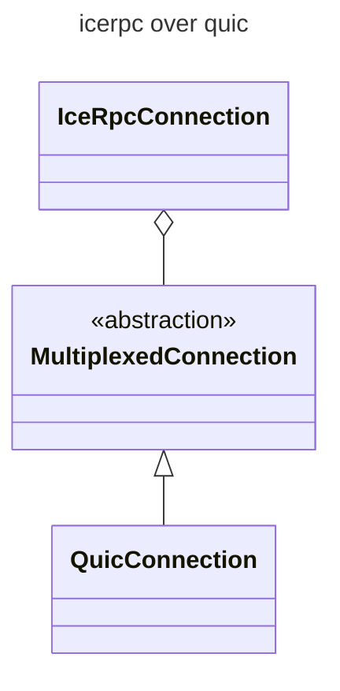
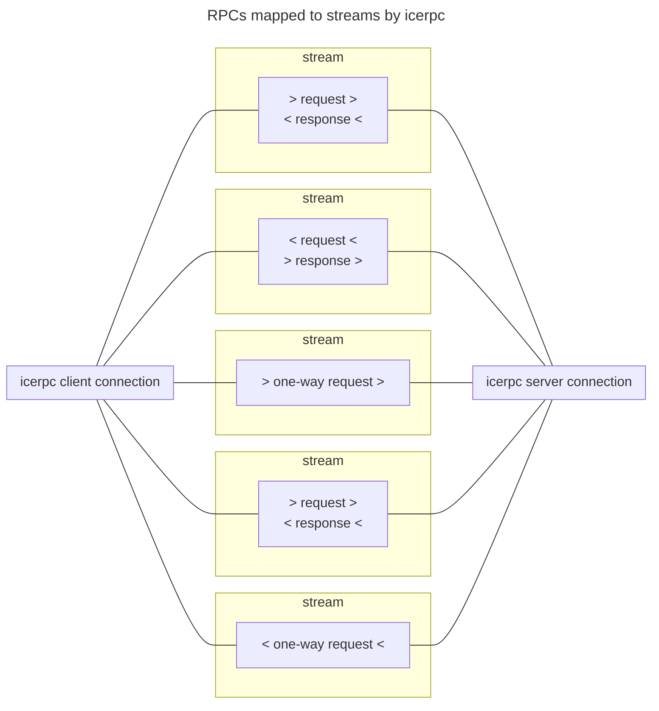
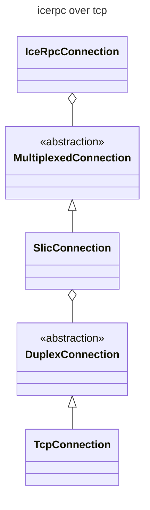

## The icerpc protocol

When you create a client connection to server address `icerpc://hello.zeroc.com`, you instruct IceRPC to establish a
connection that uses the icerpc protocol.

icerpc is an [application layer][application-layer] protocol that transmits RPCs (requests and responses) over a
multiplexed connection.


We always spell icerpc in lowercase when discussing the icerpc protocol. This avoids confusion with the IceRPC
framework.


## Multiplexed transport

The [multiplexed transport][multiplexed-transport] page describes an abstraction for a modern transport that provides
independent streams within a connection. The prototypical multiplexed transport is
[QUIC].

An icerpc connection runs over a multiplexed connection created by a multiplexed transport.



The icerpc protocol sends requests and responses over a multiplexed connection by creating a dedicated bidirectional
stream for each request + response pair. It creates a unidirectional stream for each one-way request, since a one-way
request has no response.



Since each stream is independent, there is no [head-of-line blocking][head-of-line-blocking]. You can send a mix of
large and small requests and responses over the same connection: the large requests and responses won't block or delay
the small ones.

## IceRPC's preferred protocol

icerpc is naturally IceRPC's preferred protocol.

icerpc provides the most direct realization of IceRPC's APIs and features. In particular, IceRPC's
[request fields][request-fields], [response fields][response-fields] and [status codes][status-code] are transmitted
as-is by icerpc. It also supports [payload continuations][payload-continuation].

## icerpc over QUIC

QUIC is the default multiplexed transport, so you don't need to select a transport to run icerpc over QUIC. A client
connection created from a bare `icerpc` server address uses QUIC:

```csharp
// QUIC is the default: a bare icerpc server address uses QUIC.
await using var clientConnection = new ClientConnection("icerpc://hello.zeroc.com");
```

You can also select QUIC explicitly with the `transport` parameter:

```csharp
// Select QUIC explicitly with the transport parameter.
await using var clientConnection = new ClientConnection("icerpc://hello.zeroc.com?transport=quic");
```

You can also create the QUIC transport explicitly and pass it to the connection—for instance, to configure
QUIC options:

```csharp
// Create a multiplexed client transport (QUIC) with default options.
var clientTransport = new QuicClientTransport();
await using var clientConnection = new ClientConnection(
    "icerpc://hello.zeroc.com",
    multiplexedClientTransport: clientTransport);
```

## icerpc over a duplex connection

There is currently only one standard multiplexed transport: QUIC. Since QUIC is new and not universally available, you
may want to use icerpc with a traditional duplex transport such as TCP.

The solution is IceRPC's Slic transport layer. Slic implements the multiplexed transport abstraction over the
[duplex transport][duplex-transport] abstraction.



To run icerpc over Slic-over-TCP instead of QUIC, set the transport to `tcp` in the server address:

```csharp
// Select Slic over TCP with the transport parameter.
await using var clientConnection = new ClientConnection("icerpc://hello.zeroc.com?transport=tcp");
```

You can also create the Slic-over-TCP transport explicitly and pass it to the connection—for instance, to
configure Slic or TCP options:

```csharp
// Create a multiplexed client transport (Slic over TCP) with default options.
var clientTransport = new SlicClientTransport(new TcpClientTransport());
await using var clientConnection = new ClientConnection(
    "icerpc://hello.zeroc.com?transport=tcp",
    multiplexedClientTransport: clientTransport);
```

[multiplexed-transport]: ../multiplexed-transport
[duplex-transport]: ../duplex-transport
[request-fields]: ../invocation/outgoing-request#request-fields
[response-fields]: ../invocation/incoming-response#response-fields
[status-code]: ../invocation/incoming-response#status-code
[payload-continuation]: ../invocation/outgoing-request#request-payload-and-payload-continuation

[application-layer]: https://en.wikipedia.org/wiki/Application_layer
[QUIC]: https://www.rfc-editor.org/rfc/rfc9000.html
[head-of-line-blocking]: https://en.wikipedia.org/wiki/Head-of-line_blocking
