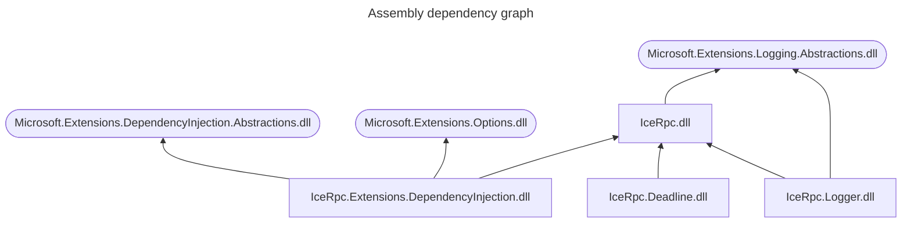

## DI as an optional feature

The first rule of DI is: don't introduce a dependency on DI.

IceRPC for C# takes this rule at heart by providing full support for DI while making this support completely optional.

The IceRPC C# API was designed to be both DI-friendly and DI container agnostic. Additionally, IceRPC provides
support code to help you use IceRPC with
[Microsoft's DI container](https://learn.microsoft.com/en-us/dotnet/core/extensions/dependency-injection).

## Namespace IceRpc.Extensions.DependencyInjection

All the DI-related APIs provided by IceRPC are in the same namespace,
[IceRpc.Extensions.DependencyInjection](csharp:IceRpc.Extensions.DependencyInjection), but are implemented by several
assemblies:
- [IceRpc](https://github.com/icerpc/icerpc-csharp/blob/main/src/IceRpc/README.md) provides abstractions such as
[IDispatcherBuilder](csharp:IceRpc.Extensions.DependencyInjection.IDispatcherBuilder) and
[IInvokerBuilder](csharp:IceRpc.Extensions.DependencyInjection.IDispatcherBuilder)
- [IceRpc.Logger](https://github.com/icerpc/icerpc-csharp/blob/main/src/IceRpc.Logger/README.md),
[IceRpc.Deadline](https://github.com/icerpc/icerpc-csharp/blob/main/src/IceRpc.Deadline/README.md) and other
interceptor/middleware assemblies provide extension methods for `IDispatcherBuilder` and `IInvokerBuilder`. These
extension methods are DI container agnostic.
- [IceRpc.Extensions.DependencyInjection](https://github.com/icerpc/icerpc-csharp/blob/main/src/IceRpc.Extensions.DependencyInjection/README.md)
provides support code for Microsoft's DI container. This includes various extension methods for
[IServiceCollection](https://learn.microsoft.com/en-us/dotnet/api/microsoft.extensions.dependencyinjection.iservicecollection), such as
`AddIceRpcServer` and `AddIceRpcClientConnection`, and implementations for `IDispatcherBuilder` and `IInvokerBuilder`.

