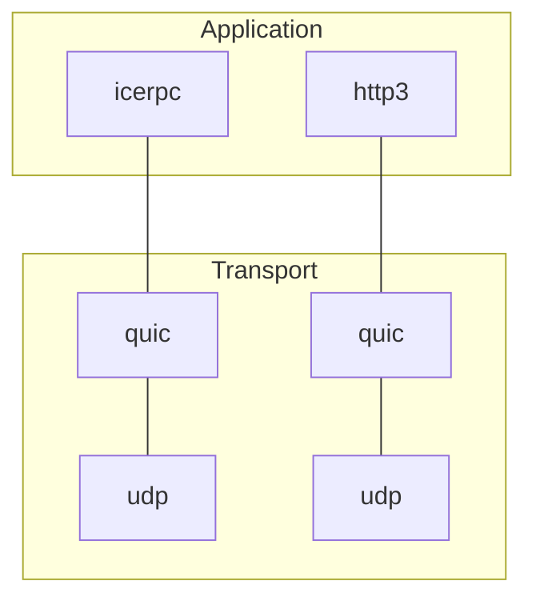



## An http3 sibling

The latest version of http, [http3](https://www.rfc-editor.org/rfc/rfc9114.html), is built over
[QUIC](https://www.rfc-editor.org/rfc/rfc9000.html), a new multiplexed transport based on UDP.

icerpc is a sibling of http3: a protocol in the application layer built over QUIC. While http3's focus is the web,
icerpc's focus is RPCs, and this narrow focus makes icerpc much simpler than http3.

