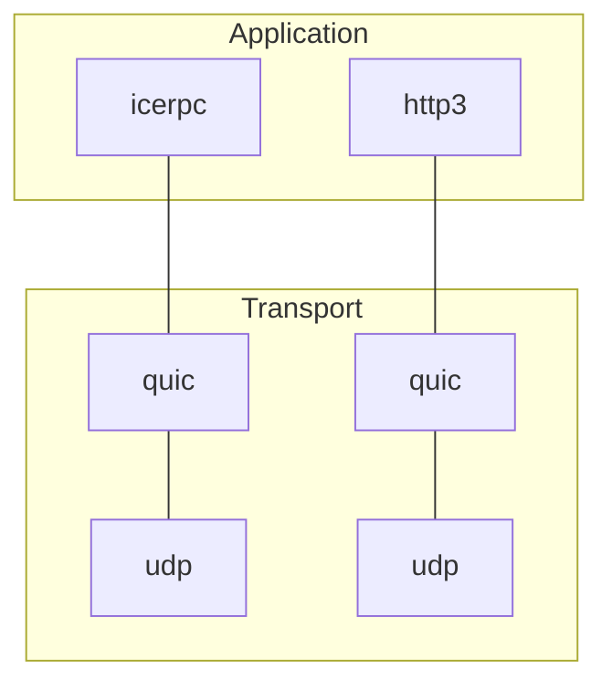



When you create a client connection to server address `icerpc://hello.zeroc.com`, you instruct IceRPC to use the icerpc
protocol. Let's have a closer look at what it means to use this protocol.


We always spell icerpc in lowercase when we talk about the icerpc protocol. This avoids confusion with the IceRPC
framework.


## An http3 sibling

The latest version of http, [http3](https://www.rfc-editor.org/rfc/rfc9114.html), is built over
[QUIC](https://www.rfc-editor.org/rfc/rfc9000.html), a new multiplexed transport based on UDP.

icerpc is a sibling of http3: a protocol in the application layer built over QUIC. While http3's focus is the web,
icerpc's focus is RPCs, and this narrow focus makes icerpc much simpler than http3.

## IceRPC preferred protocol

icerpc is naturally IceRPC's preferred protocol.

icerpc provides the most direct realization of IceRPC's APIs. For example, an IceRPC response has a status code that
indicates whether the response corresponds to a successful RPC (status code Success) or a failure (status code greater
than Success). The very same status code is encoded in the header of icerpc responses.
