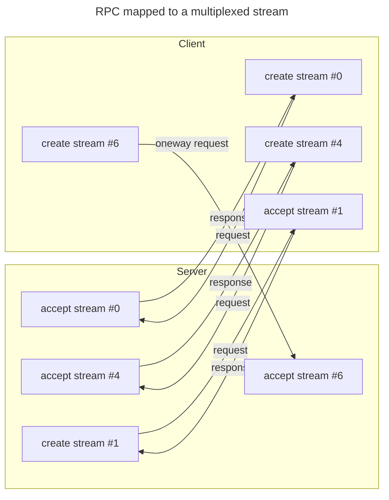



## A stream per RPC

The QUIC transport and its multiplexed transport abstraction are ideal for RPCs and the icerpc protocol takes full
advantage of these transports.

icerpc creates a dedicated multiplexed stream for each RPC. A twoway RPC, with a request and a response, is carried by a
bidirectional stream, while a oneway RPC, with a request and no response, is carried by an unidirectional stream.

A request flows from the endpoint that created the stream to the endpoint that accepted the stream. A response flows the
other way--from the endpoint that accepted the stream to the endpoint that created the stream.



## Request layout

An icerpc request consists of a header followed by a payload. As far as icerpc is concerned, the payload is just a
stream of bytes with an unknown size. The end of the multiplexed stream marks the end of the payload.

The request header holds:
 - the path of the service
 - the operation name
 - [request fields](../invocation/outgoing-request#request-fields)

icerpc transmits the request fields without attaching any meaning to their values or presence.

The request header is specified using Slice and encoded using Slice2:

```slice
compact struct Request
{
    headerSize: varuint62,
    header: RequestHeader,
    payload: ...bytes...
}

compact struct RequestHeader
{
    path: string,
    operation: string,
    fields: dictionary<RequestFieldKey, sequence<uint8>>
}
```

For example, a request for operation "op" at path "/foo" with an empty payload and no field can be encoded as:
```
0x25 0x00           : header size (9) on 2 bytes, little endian
0x10                : path size (4) on 1 byte
0x2F 0x66 0x6F 0x6F : UTF-8 encoding of "/foo"
0x08                : operation size (2) on 1 byte
0x6F 0x70           : UTF-8 encoding of "op"
0x00                : field dictionary size (0) on 1 byte (no fields)
```


With Slice2's varuint62 encoding, the first 2 bits of the first byte encode the number of bytes used to encode the
value. As a result, for a varuint62 encoded on a single byte, the encoded value is `source * 4`, and for a varuint62
encoded on 2 bytes, the encoded value is `source * 4 + 1`.


## Response layout

An icerpc response consists of a header followed by a payload. The payload of a response is just like the payload of a
request: a stream of bytes with an unknown size. The response payload ends when the multiplexed stream ends.

The response header holds:
 - a [status code](../invocation/incoming-response#status-code)
 - an error message when the status code is not Success
 - [response fields](../invocation/incoming-response#response-fields)

icerpc transmits the response fields without attaching any meaning to their values or presence.

The response header is specified in Slice (LINK) and encoded using Slice2:

```slice
compact struct Response
{
    headerSize: varuint62,
    header: ResponseHeader,
    payload: ...bytes...
}

compact struct ResponseHeader
{
    statusCode: StatusCode,
    errorMessage: string, // only present when statusCode is not Success
    fields: dictionary<ResponseFieldKey, sequence<uint8>>
}
```

For example, a response with status code Success, no fields and an empty payload can be encoded as:
```
0x09 0x00           : header size (2) on 2 bytes, little endian
0x00                : status code (0) on 1 byte
0x00                : field dictionary size (0) on 1 byte (no fields)
```
