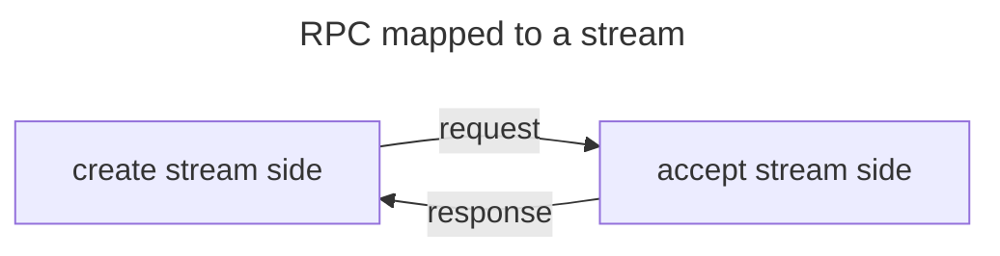



## A stream per RPC

The QUIC transport and its multiplexed transport abstraction are ideal for RPCs. A twoway RPC--a pair request and
response--simply maps to one bidirectional stream. And a oneway RPC--a request with no response--maps to one
unidirectional stream.

There is no need to identify requests and responses on these streams because:
 - the bytes sent by the side that created the stream to the side that accepted the stream represent the request
 - the bytes sent by the side that accepted the stream to the side that created the stream represent the response



## Request layout

An icerpc request consists of a header followed by a payload. As far as icerpc is concerned, the payload is just a
sequence of bytes with an unknown size. The end of the stream marks the end of the payload.

The request header is specified in Slice (LINK) and encoded using Slice2:
```slice
compact struct Request
{
    headerSize: varuint62,
    header: RequestHeader,
    payload: ...bytes...
}

compact struct RequestHeader
{
    path: string,
    operation: string,
    fields: dictionary<RequestFieldKey, sequence<uint8>>
}

unchecked enum RequestFieldKey : varuint62
{
    Context = 0,
    TraceContext = 1,
    CompressionFormat = 2,
    ...
}
```

The fields are used to transmit out-of-brand information alongside the request. icerpc itself just transmits these
fields and does not attach any meaning to their values or presence.

For example, a request for operation "op" at path "/foo" with an empty payload and no field can be encoded as:
```
0x25 0x00           : header size (9) on 2 bytes, little endian
0x10                : path size (4) on 1 byte
0x2F 0x66 0x6F 0x6F : UTF-8 encoding of "/foo"
0x08                : operation size (2) on 1 byte
0x6F 0x70           : UTF-8 encoding of "op"
0x00                : field dictionary size (0) on 1 byte (no fields)
```


With Slice2's varuint62 encoding, the first 2 bits of the first byte encode the number of bytes used to encode the
value. As a result, for a varuint62 encoded on a single byte, the encoded value is `source * 4`, and for a varuint62
encoded on 2 bytes, the encoded value is `source * 4 + 1`.


## Response layout

An icerpc response consists of a header followed by a payload. The payload of a response is just like the payload of a
request: a sequence of bytes with an unknown size. The response payload ends when the stream ends.

The response header is specified in Slice (LINK) and encoded using Slice2:
```slice
compact struct Response
{
    headerSize: varuint62,
    header: ResponseHeader,
    payload: ...bytes...
}

compact struct ResponseHeader
{
    statusCode: StatusCode,
    errorMessage: string, // only present when StatusCode > Success
    fields: dictionary<ResponseFieldKey, sequence<uint8>>
}

unchecked enum StatusCode : varuint62
{
    Success = 0,
    ApplicationError,
    ServiceNotFound,
    OperationNotFound,
    ...
}

unchecked enum ResponseFieldKey : varuint62
{
    CompressionFormat = 2,
    ...
}
```

For example, a response with status code Success, no fields and an empty payload can be encoded as:
```
0x09 0x00           : header size (2) on 2 bytes, little endian
0x00                : status code (0) on 1 byte
0x00                : field dictionary size (0) on 1 byte (no fields)
```
