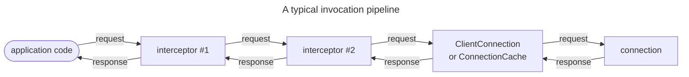
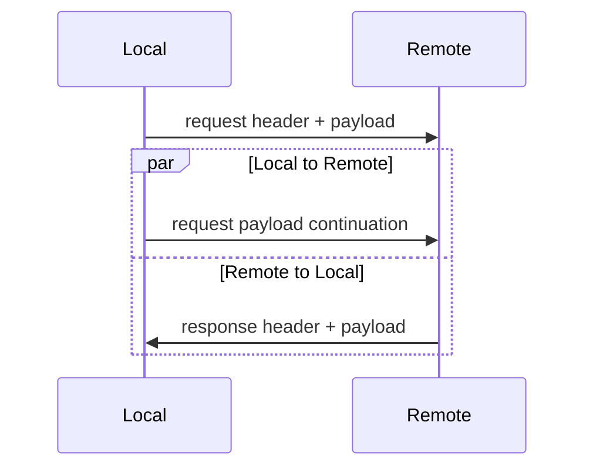



## Definition

The process of sending a request and receiving the corresponding response is called an invocation.

You would typically make invocations over client connections. Nevertheless, since client and server
[connections](../connection/client-vs-server-connections) have the same capabilities, you can also make invocations over
server connections.

## The Invoker abstraction

With IceRPC, you always make an invocation by calling an invoker. An invoker is a simple abstraction with a single
`invoke` method that accepts an outgoing request and returns an incoming response.

In C#, this abstraction is the `IInvoker` interface:
```csharp
namespace IceRpc;

public interface IInvoker
{
    Task<IncomingResponse> InvokeAsync(OutgoingRequest request, CancellationToken cancellationToken = default);
}
```

Both `ClientConnection` (C# LINK) and `ConnectionCache`(C# LINK) implement this interface. This allows you to make an
invocation by creating a client connection or a connection cache and then calling `InvokeAsync` on the resulting
instance:
```csharp
await using var clientConnection = new ClientConnection(new Uri("icerpc://hello.zeroc.com"));
using var request = new OutgoingRequest(...);

// Make an invocation by calling the IInvoker.InvokeAsync method implemented by ClientConnection.
IncomingRequest response = clientConnection.InvokeAsync(request);
```

## Invocation processing

It is common to perform additional processing on an invocation before giving it to a connection. For example, you may
want to compress the payloads of your requests, add a telemetry field to each request, add a timeout or deadline, or
simply add logging.

You can configure this processing by creating a chain of invokers--the invocation pipeline. Each node of this pipeline
is an invoker that calls `invoke` on the next invoker in the pipeline. The last invoker in the pipeline is a connection
managed by a ClientConnection or ConnectionCache. The other invokers are usually [interceptors](interceptor).



## Payload and payload continuation

An outgoing request carries all the data a connection needs to send a request:
 - the [service address](service-address)
 - the name of the operation
 - [request fields](../icerpc-protocol/mapping-rpcs-to-streams#request-layout)
 - the payload of the request (a sequence of bytes that the connection can read and logically copy to the network
 connection when sending)

The payload of an outgoing request is split in two: a first part that the connection sends before awaiting the response,
and a second part (the "continuation") that the connection sends in the background while it awaits, receives and returns
the response.



On the other side, the receiver of the request sees only one continuous request payload.
