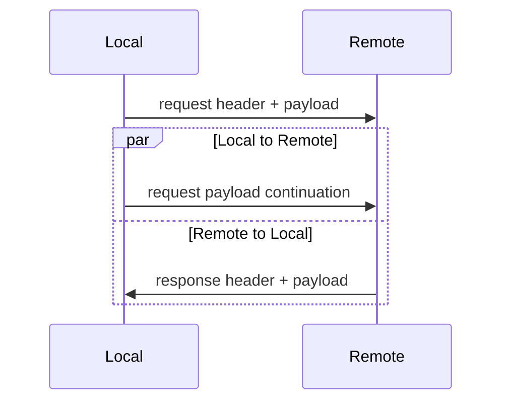



## Overview

The only way to make a RPC with IceRPC is to construct an outgoing request and then pass this request as a parameter to
the `invoke` method of an [invoker](invocation-pipeline#the-invoker-abstraction).

An outgoing request carries all the data a connection needs to send a request:
 - the [service address](service-address) of the target service
 - the name of the operation on this service
 - request [fields](#request-fields)
 - the [payload](#payload-and-payload-continuation) of the request

In C#, an outgoing request also holds [features](#request-features). These features are used for local communications
with and within the invocation pipeline.

## Request fields

The request fields represent out-of-band information carried by a request "over the wire". These fields are usually read
and written by [interceptors](interceptor) and [middleware](../dispatch/middleware) in an effort to coordinate the
processing of the same request in the client and in the server.

A field is an entry in a dictionary `RequestFieldKey` to sequence of bytes, where `RequestFieldKey` is enum defined in
Slice (LINK):
```slice
unchecked enum RequestFieldKey : varuint62
{
    Context = 0,
    TraceContext = 1,
    CompressionFormat = 2,
    ...
}
```

For example, when the Compress interceptor compresses the payload of an outgoing request, it sets the request field
CompressionFormat. This tells the Compress middleware on the other side of the connection "this payload is compressed
with brotli"; the Compress middleware can then decompress this (incoming) request payload.

## Request payload and payload continuation

The payload of a request is sequence of bytes that represents the argument(s) of an operation. An invoker does not know
the size of this sequence. When a connection sends a request, it reads and logically copy these bytes to the network
connection until there is no more byte to read.

When a connection receives a request, it reads these bytes from the network and give them to a
[dispatcher](../dispatch/dispatch-pipeline#the-dispatcher-abstraction) as the payload of an incoming request.

The payload of an outgoing request is actually split in two: a first part that the connection sends before awaiting the
response, and a second part (the "continuation") that the connection sends in the background while it awaits, receives
and returns the response.



On the other side, the dispatcher of the incoming request sees only one continuous request payload.

## Request features

It is common for invokers in an invocation pipeline to transmit information to each other during an invocation. For
example, the Retry interceptor needs to communicate with the ConnectionCache to make sure the ConnectionCache does not
keep retrying on the same server address. These invokers get and set request features (C# link) for these
communications.

You can also use these features to communicate with the invocation pipeline. For example, you can set the feature
`ICompressFeature` to ask the Compress interceptor (if installed) to compress the payload of your request:
```csharp
var request = new OutgoingRequest(serviceAddress)
{
    Payload = largePayload,
    Features = new FeatureCollection().With<ICompressFeature>(CompressFeature.Compress)
};

IncomingResponse response = await invoker.InvokeAsync(request);
```

By convention, the features are keyed using interface types, such as `ICompressFeature` in the example above.


Fields are used for communications "over the wire" while features are used for local communications within an invocation
pipeline. IceRPC provides both request fields (carried by requests) and response fields (carried by responses), but
only request features: since it's all local, there is no need for response features.

