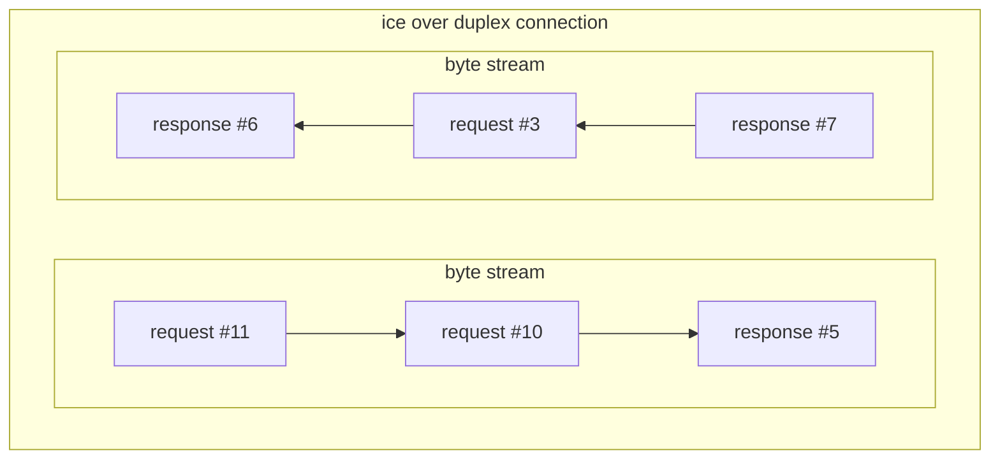



## The ice protocol

When you create a client connection to server address `ice://hello.zeroc.com`, you instruct IceRPC to establish a
connection that uses the ice protocol.

ice is an [application layer](https://en.wikipedia.org/wiki/Application_layer) protocol that transmits RPCs (requests
and responses) over a duplex connection (see below).


The ice protocol is provided for interoperability with applications built with [Ice](https://github.com/zeroc-ice/ice).
You should use [icerpc](ice-multiplexed-transports) if you don't need interop with Ice-based applications.


## Duplex transport

A duplex transport is an abstraction for a traditional transport like TCP or
[RFCOMM](https://en.wikipedia.org/wiki/List_of_Bluetooth_protocols#Radio_frequency_communication_(RFCOMM)). It creates
duplex (transport) connections. A duplex connection provides two byte streams: one from the client to the server, and
another from the server to the client.

The ice protocol sends requests and responses over this duplex connection by writing requests and responses one after
the other. Each request or response is always fully written: when you send a request or response with ice, the sending
of another request or response in the same direction will wait until after this request or response is fully written.

This serialization can result in [head-of-line blocking](https://en.wikipedia.org/wiki/Head-of-line_blocking).

If you send requests and responses concurrently over the same ice connection, make sure that all these requests and
responses are fairly small. And if you really need to send large requests or responses, you should consider creating a
separate ice connection dedicated to these large requests or responses.

## Duplex transport and TLS

The duplex transport abstraction in IceRPC includes TLS support. For example, the tcp duplex transport can create
both plain TCP connections and TCP connections with TLS. See [Security with TLS](../connection/security-with-tls) for
details.

## Configuring an ice connection

When you establish an ice connection, there is no ice-level exchange with the peer, and as a result all the settings for
an ice connection are purely local.

An ice connection provides the following ice-specific settings:

- Idle timeout
  TBD

- Max frame size
  TBD

## Limitations of the ice protocol

The following IceRPC features are not available with the ice protocol:

- payload continuations (LINK)
- request fields other than Context and Idempotent
- response fields
- status codes other than Success, ApplicationError, ServiceNotFound, OperationNotFound and UnhandledException
