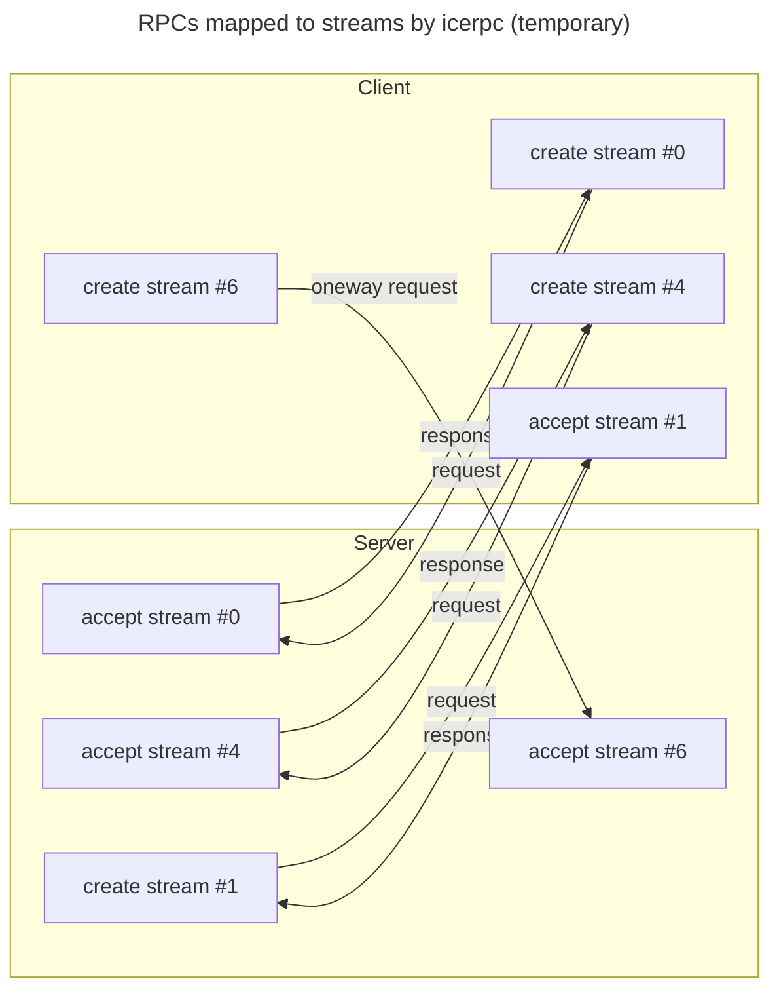



## The icerpc protocol

When you create a client connection to server address `icerpc://hello.zeroc.com`, you instruct IceRPC to establish a
connection that uses the icerpc protocol.

icerpc is an [application layer](https://en.wikipedia.org/wiki/Application_layer) protocol that transmits RPCs (requests
and responses) over a multiplexed connection (see below).


We always spell icerpc in lowercase when we talk about the icerpc protocol. This avoids confusion with the IceRPC
framework.


## Multiplexed transport

A multiplexed transport is an abstraction for a modern transport that provides independent streams within a connection.
The prototypical multiplexed transport is [QUIC](https://www.rfc-editor.org/rfc/rfc9000.html).

A multiplexed transport creates multiplexed connections used by icerpc connections.

The icerpc protocol sends requests and responses over a multiplexed connection by creating a dedicated bidirectional
stream for each request + response. It creates a unidirectional stream for each oneway request, since a oneway request
has no response.

Since each stream is independent, there is no
[head-of-line blocking](https://en.wikipedia.org/wiki/Head-of-line_blocking) like with the ice protocol. You can send
a mix of large and small requests and responses over the same connection: the large requests and responses won't block
or delay the small ones.

## IceRPC preferred protocol

icerpc is naturally IceRPC's preferred protocol.

icerpc provides the most direct realization of IceRPC's APIs and features. For example, an IceRPC response has a status
code that indicates whether the response corresponds to a successful RPC (status code Success) or a failure (status code
greater than Success). The very same status code is encoded in the header of icerpc responses.
