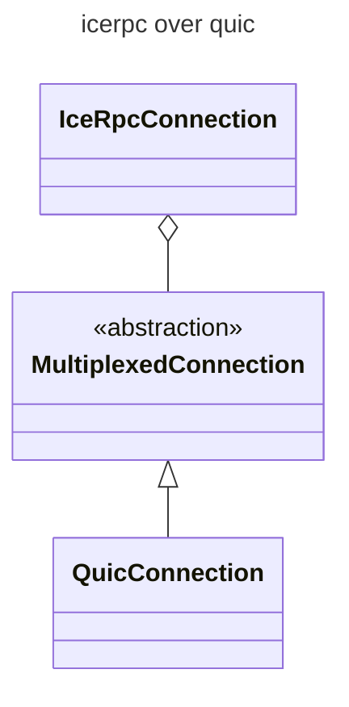
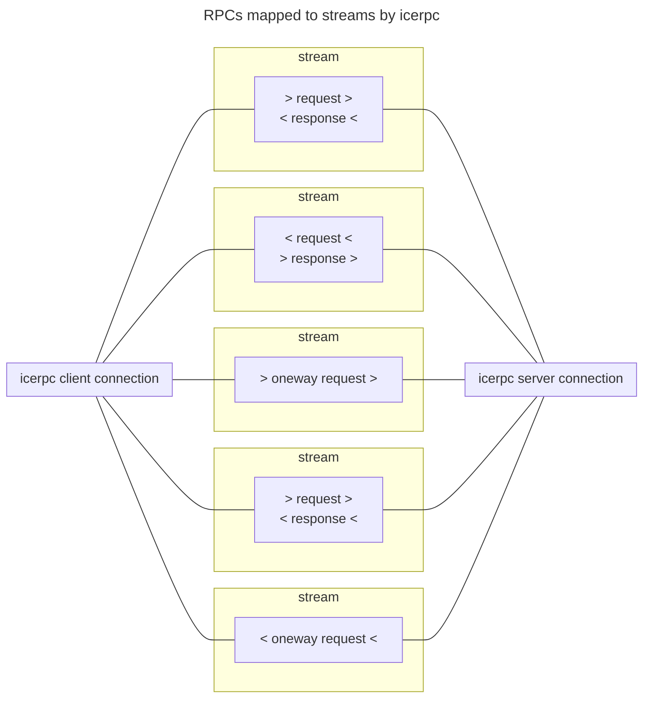
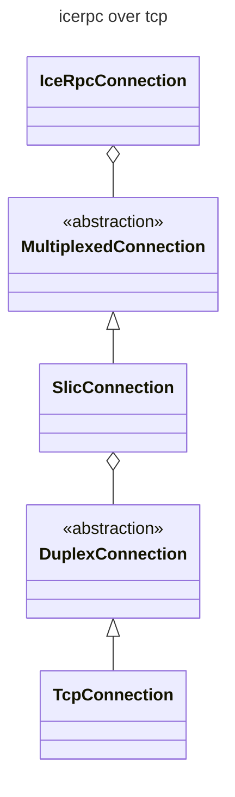



## The icerpc protocol

When you create a client connection to server address `icerpc://hello.zeroc.com`, you instruct IceRPC to establish a
connection that uses the icerpc protocol.

icerpc is an [application layer](https://en.wikipedia.org/wiki/Application_layer) protocol that transmits RPCs (requests
and responses) over a multiplexed connection.


We always spell icerpc in lowercase when discussing the icerpc protocol. This avoids confusion with the IceRPC
framework.


## Multiplexed transport

A multiplexed transport is an abstraction for a modern transport that provides independent streams within a connection.
The prototypical multiplexed transport is [QUIC](https://www.rfc-editor.org/rfc/rfc9000.html).

An icerpc connection runs over a multiplexed connection created by a multiplexed transport.



The icerpc protocol sends requests and responses over a multiplexed connection by creating a dedicated bidirectional
stream for each request + response pair. It creates a unidirectional stream for each oneway request, since a oneway
request has no response.



Since each stream is independent, there is no
[head-of-line blocking](https://en.wikipedia.org/wiki/Head-of-line_blocking). You can send a mix of large and small
requests and responses over the same connection: the large requests and responses won't block or delay the small ones.

## IceRPC preferred protocol

icerpc is naturally IceRPC's preferred protocol.

icerpc provides the most direct realization of IceRPC's APIs and features. In particular, IceRPC's
[request fields](../invocation/outgoing-request#request-fields),
[response fields](../invocation/incoming-response#response-fields) and
[status codes](../invocation/incoming-response#status-code) are transmitted as-is by icerpc.

## icerpc over a duplex connection

There is currently only one standard multiplexed transport: QUIC. Since QUIC is new and not universally available, you
may want to use icerpc with a traditional duplex transport such as TCP.

The solution is IceRPC's Slic component. Slic implements the multiplexed transport abstraction over the
[duplex transport](ice-duplex-transports) abstraction.



In C#, the default multiplexed transport is Slic over TCP and is called `tcp`. The following statements all create
equivalent icerpc connections.
```csharp
// Create a client connection with the default multiplexed client transport, Slic over TCP.
using await var clientConnection = new ClientConnection("icerpc://hello.zeroc.com");

// Make sure we use Slic over TCP (correct but redundant).
using await var clientConnection = new ClientConnection("icerpc://hello.zeroc.com?transport=tcp");

// Create a new multiplexed client transport with default options.
var clientTransport = new SlicClientTransport(new TcpClientTransport());
using await var clientConnection = new ClientConnection(
    "icerpc://hello.zeroc.com",
    multiplexedClientTransport: clientTransport);
```
