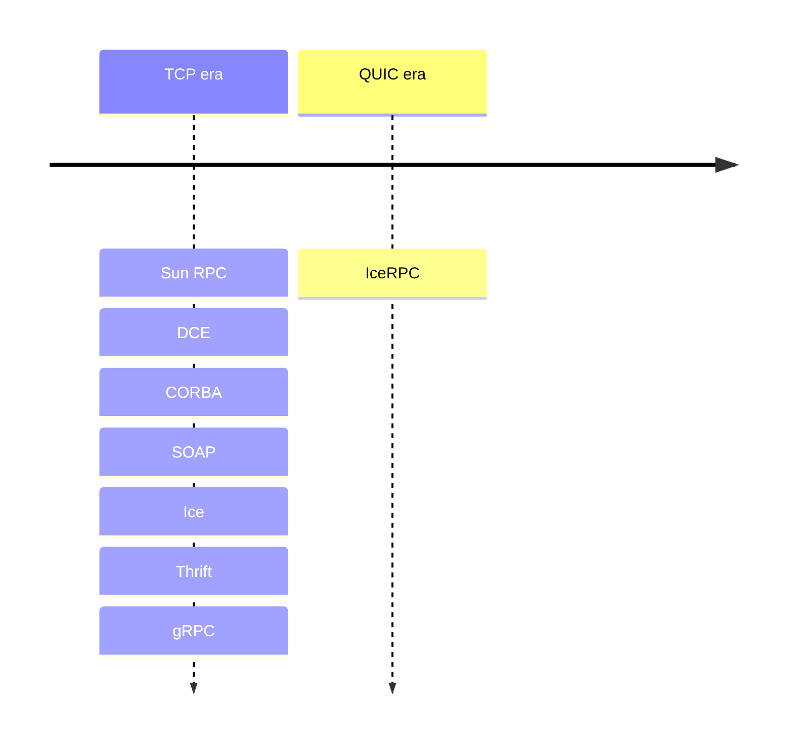
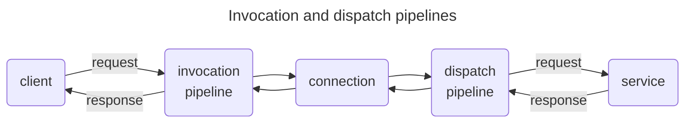

## RPCs over QUIC

Ever since the first RPC framework was created by Sun Microsystems in the 1980s, the primary transport protocol for RPCs
has been TCP.

DCE, CORBA, SOAP, Ice, Thrift and more recently gRPC all use primarily or only TCP connections to transmit requests and
responses.

TCP is ubiquitous today but is also showing its limits: handshakes with TLS is a laborious process, TCP retransmissions
can significantly degrade performance, and more. The answer to TCP's woes is [QUIC][quic], a new UDP-based protocol
ratified in 2021 with implementations for all modern systems. QUIC underpins the latest revision of the HTTP protocol
([HTTP/3][http3]).

QUIC provides independent streams within the same reliable connection, and these streams are a perfect fit for RPCs:
a RPC maps to a QUIC stream, with the request flowing in one direction and the response in the other. We anticipate that
over time QUIC will become the dominant transport protocol for RPC frameworks.

IceRPC is a new RPC framework built from the ground-up to take full advantage of QUIC, with support for bidirectional
streaming. It is the first RPC framework of the QUIC era:



### Not only for QUIC

The primary transport for IceRPC is QUIC, but we're still in the early days of QUIC, so being QUIC-only is not
practical.

To bridge this gap, IceRPC provides a multiplexing adapter called [Slic][slic]. Slic implements a QUIC-like multiplexed
transport over any duplex transport such as TCP. This way, you can use IceRPC with QUIC, with TCP (via Slic), and with
various other traditional transports such as Bluetooth, [iAP][iap], named pipes, etc.


Slic over TCP suffers from the same [head-of-line blocking][hol] issue as HTTP/2. QUIC was created in part to address
this issue.


## The async/await pattern

IceRPC rests on two pillars: QUIC and the [async/await][async-await] pattern.

Async/await allows you to utilize threads efficiently when making calls that wait for I/O, and RPCs are all about
network I/O. Async/await also makes your code easier to read and maintain: you can see immediately when you make an RPC
versus a local synchronous call since all RPC calls have "async" APIs that are usually awaited. For example:


```csharp 
// It's unclear if this is a remote call that takes
// milliseconds or a local call that takes at most
// a few microseconds.
// In any case, this call is holding onto its
// thread until it completes.
string greeting = greeterProxy.Greet(name);
```

```csharp 
// We see it's a special call thanks to await and
// the Async suffix. GreetAsync releases the thread
// while waiting for the response from the peer and
// it's just as easy to write as the synchronous
// version.
string greeting = await greeterProxy.GreetAsync(name);
```


With IceRPC, all calls that make network I/O are async and only async. IceRPC does not provide a second blocking
synchronous API like older RPC frameworks. Such a blocking API is not just redundant: it's confusing and harmful. A
modern application should always make sync and async calls as appropriate.

## Modular and extensible

When you make an RPC with IceRPC, your request and response travel through an invocation pipeline (on the client side)
and a dispatch pipeline (on the server side):



These pipelines intercept your requests and responses and you decide what they do with them. If you want to log your
requests and responses, add the Logger interceptor to your invocation pipeline or the Logger middleware to your
dispatch pipeline. If you want to retry automatically failed requests that can be retried, add the Retry interceptor to
your invocation pipeline. IceRPC provides a number of interceptors and middleware for compression, deadlines, logging,
metrics, OpenTelemetry integration, and more. You can also easily create and install your own interceptors or middleware
to customize these pipelines.

Since all this functionality is optional and not hard-coded in IceRPC, you can choose exactly the behavior you want. For
example, you don't need the Compressor interceptor if you're not compressing anything: if you don't install this
interceptor, there is no compression code at all. Less code means simpler logic, fewer dependencies, faster execution
and fewer bugs.

This modularity and extensibility is everywhere in IceRPC. For instance, you can easily implement a new duplex or
multiplexed transport and then plug it in IceRPC. All the transport interfaces are public and fully documented.

[async-await]: https://en.wikipedia.org/wiki/Async/await
[hol]: https://en.wikipedia.org/wiki/Head-of-line_blocking
[http3]: https://en.wikipedia.org/wiki/HTTP/3
[iap]: https://en.wikipedia.org/wiki/List_of_Bluetooth_profiles#iPod_Accessory_Protocol_(iAP)
[quic]: https://en.wikipedia.org/wiki/QUIC
[slic]: ../../icerpc-core/slic-protocol/introduction
