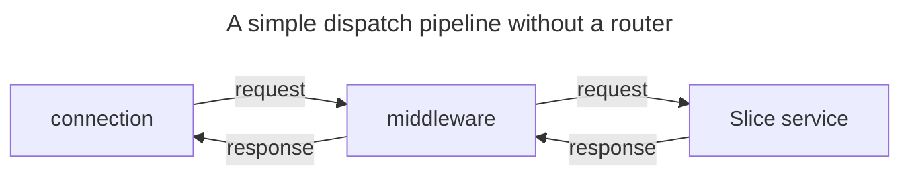

## Definition

The process of accepting/fulfilling a request and returning a response is called a dispatch.

Dispatches are typically created by server connections: a server connection receives a request, dispatches this request
and then sends back the response provided by the dispatch.

Nevertheless, since client and server [connections][connections] have the same capabilities, client connections can also
dispatch requests.

## The Dispatcher abstraction

When a connection receives a request, it dispatches this request using its configured dispatcher. This dispatcher is an
abstraction with a single `dispatch` method that accepts an incoming request and returns an outgoing response. It's the
server-side counterpart to the [Invoker](../invocation/invocation-pipeline#the-invoker-abstraction) abstraction.

An important difference between Invoker and Dispatcher is you need to implement this Dispatcher abstraction to fulfill
the requests and produce the responses. The Invoker abstraction is implemented by IceRPC's connections.

In C#, this dispatcher abstraction is the [`IDispatcher`][dispatcher-interface] interface:

```csharp
namespace IceRpc;

public interface IDispatcher
{
    ValueTask<OutgoingResponse> DispatchAsync(IncomingRequest request, CancellationToken cancellationToken = default);
}
```

You configure the dispatcher of a server connection when you construct the server that accepts this connection. This
dispatcher can't be null. A server shares its dispatcher with all the connections it accepts. For example:

```csharp
// configures server to use a new Chatbot instance as its dispatcher
await using var server = new Server(new Chatbot());
```

Configuring a dispatcher for a client connection is optional since a client connection does not have to accept requests.

In C#, you configure the dispatcher of a client connection with the `ConnectionOptions` class. For example:

```csharp
using IceRpc;

// ClientConnectionOptions derives from ConnectionOptions
var clientConnectionOptions = new ClientConnectionOptions
{
    Dispatcher = new MyCallback(),
    ServerAddress = new Uri("icerpc://hello.zeroc.com")
};

await using var connection = new ClientConnection(clientConnectionOptions);
```

## Dispatch processing

The dispatcher abstraction offers a great deal of flexibility. A [Slice service][slice-service] is a dispatcher, so it's
trivial to configure a server to dispatch all the requests it receives to the same Slice service.

A dispatcher implementation can dispatch to another dispatcher, which itself dispatches to another dispatcher, and so
on; the dispatcher you configure on a server can be the head of a dispatcher chain or tree, known as a
"dispatch pipeline".

There are 3 common types of dispatchers:

- **Leaf dispatcher**\
  It's a leaf in the dispatch pipeline that implements `dispatch` without the help of another dispatcher. For example,
  a Slice service.

- **Middleware**\
   A [middleware](middleware) intercepts a dispatch and forwards it to the "next" dispatcher. IceRPC provides several
   built-it middleware for logging, compression and more.

- **Router**\
   A [router](router) routes a request to a dispatcher registered with this router based on the request's path. It can
   also host middleware.



[connections]: ../connection/how-to-create-a-connection
[slice-service]: ../../slice/language-guide/interface
[dispatcher-interface]: csharp:IceRpc.IDispatcher
