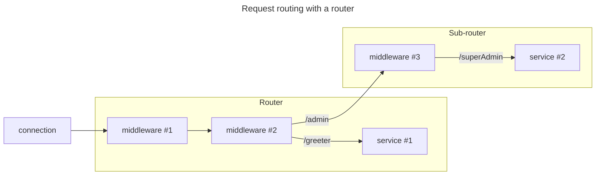

## Path-based routing

A router is a dispatcher than routes incoming requests to other dispatchers based on the request's path. It can also
execute middleware along this route.



These other dispatchers are registered with the router using `map` and `mount` methods.

- `map` associates a dispatcher with a path in the router.

    For example, you can map path `/greeter` to the chatbot service. It's an exact match. A request with path `/`,
    `/greeter2` or `/greeter/foo` is not a match.

    In C#, you would write:

    ```csharp
    var router = new Router();
    router.Map("/greeter", chatbot);
    ```

- `mount` associates a dispatcher with a path prefix in the router.

    For example, you can mount path-prefix `/greeter` to the chatbot service. A request with path `/greeter` or
    `/greeter/foo` is a match. A request with path `/`, `/greeter2` is not a match.

    In C#, you would write:

    ```csharp
    var router = new Router();
    router.Mount("/greeter", chatbot);
    ```

It is common to map leaf dispatchers such as services and mount sub-routers, but it's not a hard and fast rule.

You can map and mount the exact same path (for example, `/greeter`). The router will direct a request with path
`/greeter` to the mapped dispatcher and a request with path `/greeter/foo` to the mounted dispatcher.

If a router does not find a mapped or mounted dispatcher for an incoming request's path, it throws
`DispatchException(IceRpcError.ServiceNotFound)`.

## Sub-router

A sub-router is a router registered with another "parent" router. It has a prefix that corresponds to its mount point;
it removes this prefix when it looks up a dispatcher registered via `map` or `mount`.

In C#, you can create a sub-router and mount it in a single step with the `Route` extension method:

```csharp
var router = new Router();

// create a sub-router and mount it at /admin
router.Route("/admin", subRouter => subRouter.UseDispatchInformation().Map("/superAdmin", root));
```

The full path to the `root` service with this example is `/admin/superAdmin`. The admin sub-router removes `/admin`
from the request's path before trying to match this path against entries in its map and mount dictionaries.

## Installing a middleware in a router

A router can execute one or more middleware before handing over the request to a mapped or mounted dispatcher.

In C#, these middleware are registered with `Use{Name}` extension methods on class [`Router`][csharp-router]. For
example:

```csharp
Router router = new Router().UseLogger(loggerFactory).UseCompressor();
router.Map("/greeter", new Chatbot());
```

The order in which you install these middleware is often important. The first middleware you install is the first
middleware to execute. With the example above, the logger middleware executes first, then calls `DispatchAsync` on the
compressor middleware, and then finally the compressor middleware calls `DispatchAsync` on the `Chatbot` service mapped
at `/greeter`.


The router always dispatches incoming requests to its registered middleware, even when it ends up throwing
`DispatchException(IceRpcError.ServiceNotFound)` because it can't find a match for the incoming request's path.


## Installing a middleware with Dependency Injection

If you use Microsoft's Dependency Injection container, you should use a dispatcher builder instead of `Router` to
create your dispatch pipeline. The `Use{Name}` extension methods for [`IDispatcherBuilder`][dispatcher-builder] retrieve
dependencies automatically from the DI container.

For example:

```csharp
services.AddIceRpcServer(builder => builder.UseLogger().UseCompressor().Mount<IGreeterService>("/"));
```

This is equivalent to our earlier example except `UseLogger` retrieves the logger factory from the DI container.
`Mount<IGreeterService>("/")` retrieves an `IGreeterService` instance from the DI container for each dispatch.


There is only one [`LoggerMiddleware`][logger-middleware] class, one [`CompressorMiddleware`][compressor-middleware]
class etc. These middleware can be installed in several different dispatch pipeline implementations, such as `Router`,
the implementation inside the builder created by [`AddIceRpcServer`][add-icerpc-server], or even your own custom
dispatch pipeline class. Each dispatch pipeline implementation just needs its own set of `Use{Name}` extension methods.


[add-icerpc-server]: csharp:IceRpc.Extensions.DependencyInjection.ServerServiceCollectionExtensions
[compressor-middleware]: csharp:IceRpc.Compress.CompressMiddleware
[csharp-router]: csharp:IceRpc.Router
[dispatcher-builder]: csharp:IceRpc.Extensions.DependencyInjection.IDispatcherBuilder
[logger-middleware]: csharp:IceRpc.Logger.LoggerMiddleware
