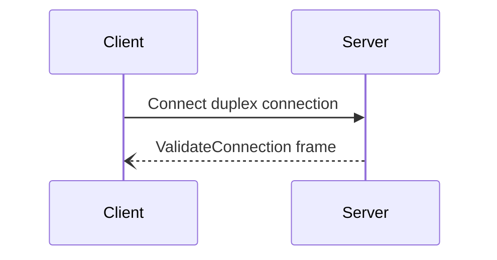

## Connection establishment steps

An ice client connects to an ice server as follows:

1. The client opens a duplex connection to the server.

2. The server accepts this duplex connection.

3. Both the client and the server "connect" the duplex connection. This connect operation is transport-dependent: it's
no-op for a plain TCP connection and it corresponds to the TLS handshake for a TCP+TLS connection.

4. The server sends a ValidateConnection frame to the client. As soon as the server sends this frame, it considers the
connection established and can start accepting incoming requests and sending outgoing requests on this connection.

5. The client waits until it receives a ValidateConnection frame from the server. When the client receives this frame,
it considers the connection established and can start sending outgoing requests and accepting incoming requests on
this connection.

The following sequence diagram shows the interactions between the client and server on connection establishment:

## ValidateConnection frame

The ValidateConnection frame is an ice protocol frame with type ValidateConnection. Its body is empty. The server-side
of an ice connection sends this frame to the client-side during connection establishment (see above).

This frame is also used for heartbeats: once the connection is established, the client or the server can send a
ValidateConnection frame to its peer, and the peer will receive and ignore this frame. A heartbeat corresponds to one
ValidateConnection frame.
