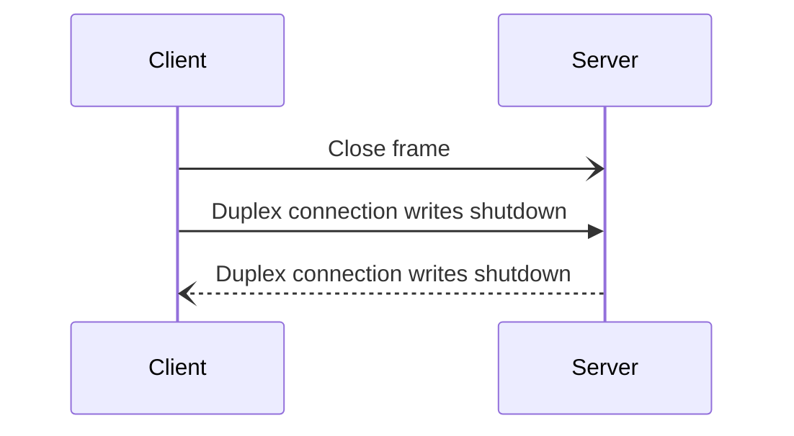
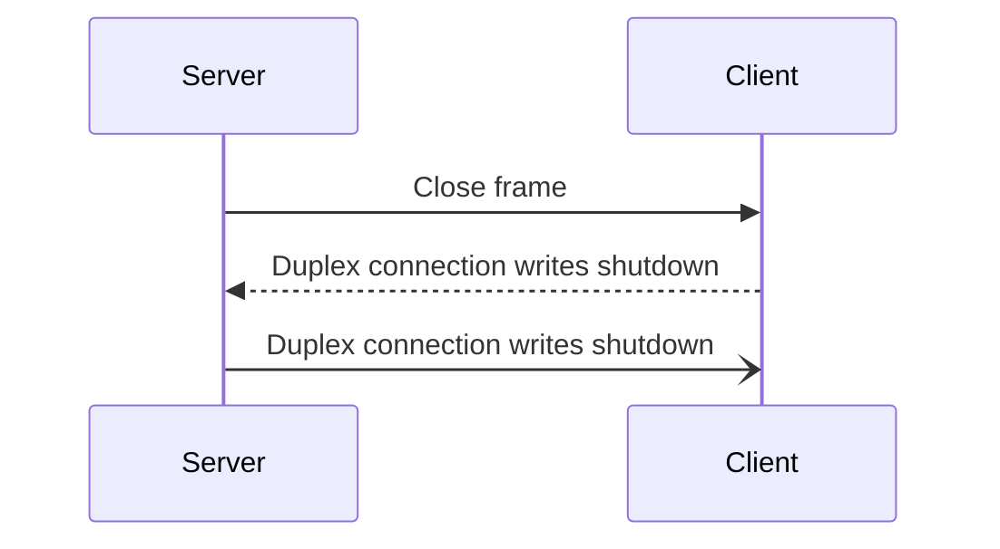

## What's connection closure?

Connection closure is either graceful or abortive. Once a connection is closed, no more data is exchanged between the
client and server. Graceful or abortive connection closure can be initiated by the client or server. In both cases, the
application must:

- Stop accepting or creating streams.

- Consider opened streams closed.

Creating or accepting a stream, reading or writing data on a stream must fail once the connection is closed. If the
duplex connection is lost or because of a protocol error, the application must abort the connection.

## Graceful connection closure

Graceful connection closure shouldn't wait for streams to be closed. If the application wants communications on the
streams to cease first, it's responsible for closing the streams then wait for their closure before closing the
connection.

The closure of the connection on the client follows these steps:

1. It sends a [Close][close-frame] frame to the server.

2. It shuts down writes on the duplex connection.

3. Upon receiving the Close frame and the  writes shutdown notification, the server shuts down writes on the duplex
   connection and considers the connection closed.

4. Upon receiving the writes shutdown notification, the client considers the connection closed.

The following sequence diagram shows the interactions between the client and server when the connection closure is initiated by the client:

The closure of the connection on the server is different. It follows these steps:

1. It sends a Close frame to the client.

2. Upon receiving the Close frame, the client shuts down writes on the duplex connection.

3. Upon receiving the writes shutdown notification, the server shuts down writes on the duplex connection and considers
   the connection closed.

4. Upon receiving the writes shutdown notification, the client considers the connection closed.

The following sequence diagram shows the interactions between the client and server when the connection closure is initiated by the server:


The difference between the client and the server connection closure is the timing of the duplex connection writes shutdown. The duplex connection writes shutdown is always first initiated by the client. When using the TCP transport, this ensures sockets won't be left in the TIME_WAIT state on the server.


The Close frame carries an application error code. This error code provides the reason for the connection closure.

## Abortive connection closure

Abortive connection closure must abort the duplex connection. The duplex connection abort must immediately cease
communication between the client and server.

[close-frame]: protocol-frames#close-frame
