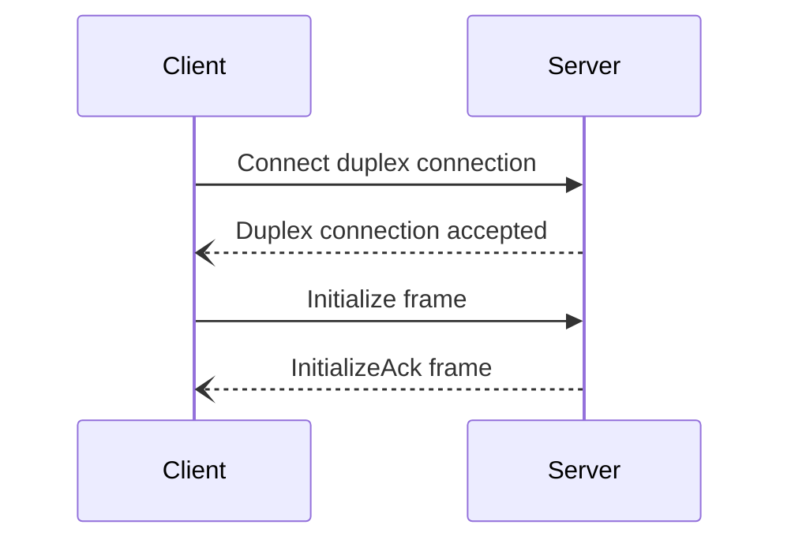
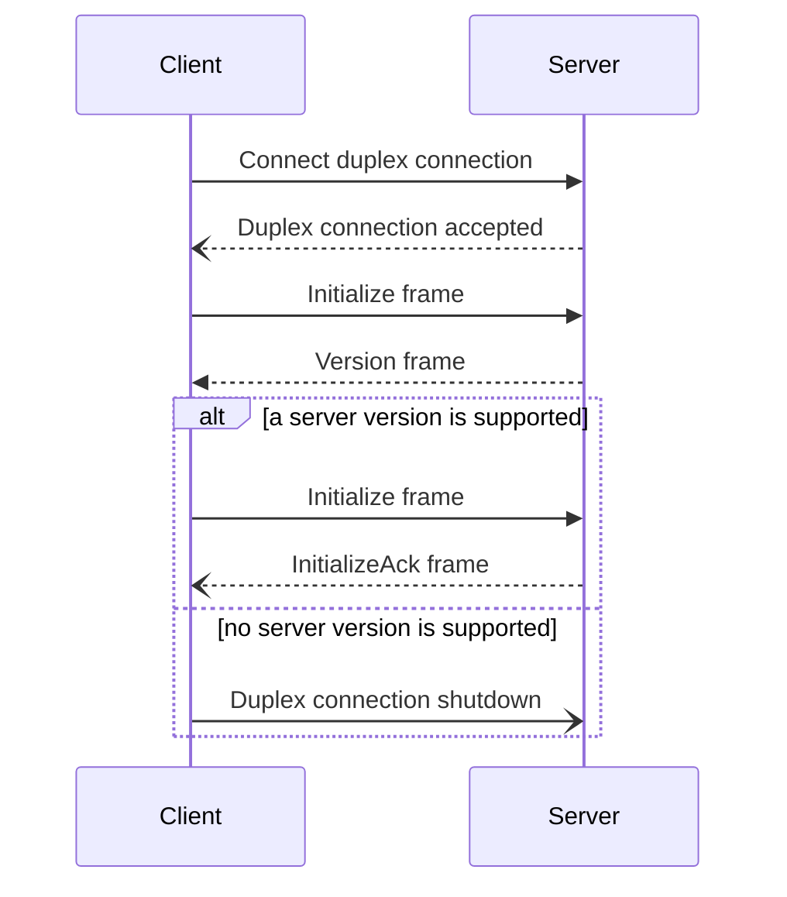

## Introduction

Connection establishment serves two purposes:

- The Slic version negotiation.

- The transmission of transport parameters on both sides of the connection.

Connection establishment relies on the [Initialize][initialize-frame], [Version][version-frame] and [InitializeAck][initialize-ack-frame] frames.

## Connection establishment steps

A Slic connection is established as follows:

1. The client opens a duplex connection to the server.

2. The server accepts this duplex connection.

3. The client sends the Initialize frame to the server.

4. The server receives this frame and sends back either:

    - The InitializeAck frame if it supports the Slic version specified in the Initialize frame. Once it sent this
      frame, the server considers the connection established.

    - Or the Version frame with the Slic versions it supports.

5. If the client receives the InitializeAck frame, it considers the connection  established. Otherwise if it receives
   the Version frame, it checks the versions supported by the server:

    - If it doesn't support any, it shuts down the duplex connection.

    - Otherwise, it sends again the Initialize frame with a supported version and waits for the server to send back the
      InitializeAck frame.

The following sequence diagram shows the interactions between the client and server on connection establishment when the client version is supported by the server:

And the following sequence diagram shows the interactions when the client version is not supported by the server:

A Version frame containing the version carried by the Initialize frame is considered a protocol error.

Streams can be created or accepted once the connection is considered established.

## Connection establishment parameters

A number of parameters are exchanged with the Initialize and InitializeAck frames. The following table describes each parameter:

| Name | Description |
| ---- | ----------- |
| `IdleTimeout` | Specifies how long a connection can be inactive before it's considered lost. |
| `MaxBidirectionalStreams` | Specifies the maximum number of concurrent bidirectional streams the peer is allowed to open. |
| `MaxUnidirectionalStreams` | Specifies the maximum number of concurrent unidirectional streams the peer is allowed to open. |
| `InitialStreamWindowSize` | Specifies the initial stream window size used for stream flow control. |
| `MaxStreamFrameSize` | Specifies the maximum amount of data carried by a Stream or StreamLast frame. |

[initialize-frame]: protocol-frames#initialize-frame
[initialize-ack-frame]: protocol-frames#initializeack-frame
[version-frame]: protocol-frames#version-frame
