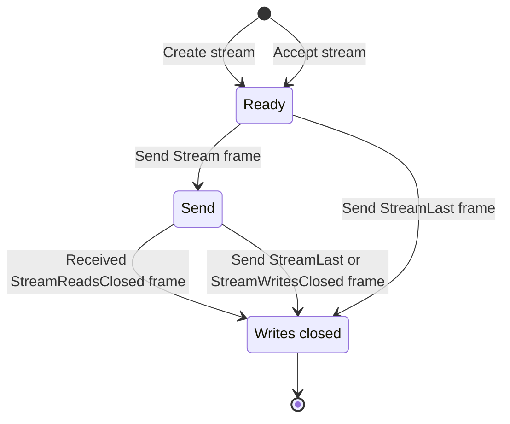
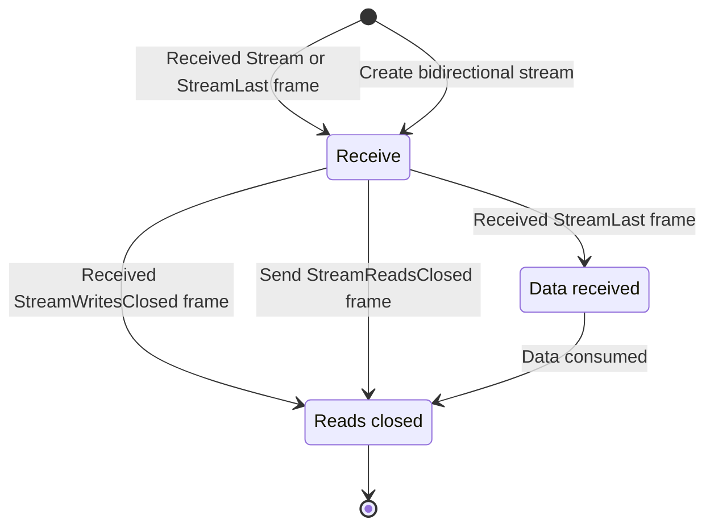

## What is a stream?

Data is transmitted through independent bidirectional or unidirectional streams. Unidirectional streams carry data from
the initiator of the stream to the peer. Data can be transmitted in both directions of a bidirectional stream. Multiple
streams can be opened at the same time on a multiplexed connection. Streams are identified by an ever increasing 62-bit
integer.

Slic stream identifiers are similar to QUIC, see [RFC9000][rfc9000]. The first least significant bit of a stream
identifier specifies if the initiator is the client or the server. The second least significant bit specifies if the
stream is bidirectional or unidirectional. The following table summarizes the four stream types:

| Bits | Stream Type                      |
| ---- | -------------------------------- |
| 0x00 | Client-Initiated, Bidirectional  |
| 0x01 | Server-Initiated, Bidirectional  |
| 0x02 | Client-Initiated, Unidirectional |
| 0x04 | Server-Initiated, Unidirectional |

The following table describes the stream frames defined by the Slic transport protocol:

| Frame Type         | Description                                                                   |
| ------------------ | ----------------------------------------------------------------------------- |
| Stream             | Carries application data.                                                     |
| StreamLast         | Carries application data and informs the peer that no more data will be sent. |
| StreamReadsClosed  | Informs the peer of the stream reads closure.                                 |
| StreamWritesClosed | Informs the peer of the stream writes closure.                                |
| StreamWindowUpdate | Informs the peer of a stream window update.                                   |

Stream frames are sent over the Slic's underlying duplex connection. The sending of a stream frame can therefore block the sending of other stream frames or connection frames.

## Stream creation

Stream creation is initiated by the sending of the first [Stream][stream-frame] or [StreamLast][stream-last-frame] frame with a newly allocated stream identifier. Sending a control stream frame with a newly allocated stream identifier is a protocol error.

The peer accepts a new stream when it receives a Stream or StreamLast frame with a stream identifier larger than the
last accepted stream identifier.

The stream identifier must be the next expected stream identifier. For example, if the last stream accepted by the server is the bidirectional stream with the identifier 0, the next stream identifier must be 4.

## Stream closure

Each side of a stream maintains a reads and writes closed state. When the application is done sending data on a stream, it closes writes on the stream. When it's done reading data, it closes reads.

The update of the closed state must trigger the sending of a control frame:

- When reads are closed, the transport implementation must send a [StreamReadsClosed][stream-reads-closed-frame] frame. Upon receiving this frame, the peer must stop sending data over the stream and close the stream writes.

- When writes are closed, the transport implementation must send a [StreamWritesClosed][stream-writes-closed-frame]
  frame. Upon receiving this frame, the peer must stop reading data from the stream and close the stream reads.

A stream is considered closed when both writes and reads are closed.

## Sending and receiving data over a stream

The Stream and StreamLast frames cary a sequence of bytes provided by the application. Multiple Stream frames can be
sent over the Slic connection for a specific stream. They will be received in order by the peer. The StreamLast frame
cary the last sequence of bytes delivered to the peer. Upon receiving this frame, the peer can assume that no more data
will be sent for this stream.

Sending a Stream frame after a StreamLast frame or multiple StreamLast frames for the same stream is considered a
protocol error.

[Head-of-line blocking][hol] very much depends on the size of a Stream or StreamLast frame. A large stream frame will
cause more head-of-line blocking that smaller stream frames. The [MaxStreamFrameSize][connection-parameters] parameter
exchanged on connection establishment limits the maximum size of a Stream or StreamLast frame. If the application data
is larger than this parameter value, the data will be sent in chunks with multiple Stream frames.

## Stream states

The following state diagram shows the states of the stream write side.

And the following state diagram shows the states of the stream read side.

[rfc9000]: https://www.rfc-editor.org/rfc/rfc9000.html#name-stream-types-and-identifier
[hol]: https://en.wikipedia.org/wiki/Head-of-line_blocking
[connection-parameters]: connection-establishment#connection-establishment-parameters
[stream-frame]: protocol-frames#stream-and-streamlast-frames
[stream-last-frame]: protocol-frames#stream-and-streamlast-frames
[stream-reads-closed-frame]: protocol-frames#streamreadsclosed-and-streamwritesclosed-frames
[stream-writes-closed-frame]: protocol-frames#streamreadsclosed-and-streamwritesclosed-frames
[stream-window-update-frame]: protocol-frames#streamwindowupdate-frame
