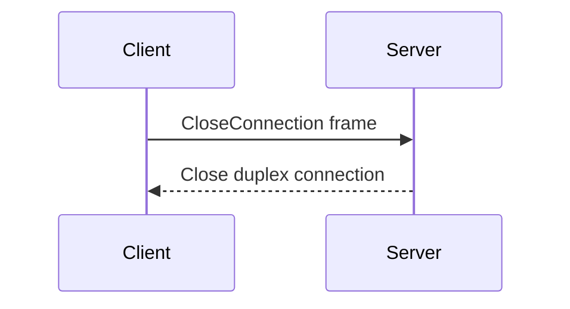

A shutdown is a graceful closure of a connection. Each side wants to maximize the chances that outstanding requests
complete successfully.

## Shutdown steps

A client or a server follows these steps when it wants to shutdown an ice connection:

1. Stop sending new requests to the peer, and stop accepting new requests from the peer.

2. Wait for all (local) invocations and dispatches to complete.

3. Stop sending [heartbeats](connection-establishment#validateconnection-frame) to the peer.

4. Send a [`CloseConnection`](#closeconnection-frame) frame to the peer.\
The client or server skips this step if it already received a `CloseConnection` frame from the peer.

5. Wait for a `CloseConnection` frame from the peer or for the peer to close the duplex connection.\
This indicates the peer has completed all processing and it's safe to proceed to step 6.

6. Close the duplex connection.

The following sequence diagram shows the interactions between the client and server on connection shutdown:

## CloseConnection frame

The `CloseConnection` frame is an ice protocol frame with type `CloseConnection`. Its body is empty. A client or server
must not send any additional frame after sending a `CloseConnection` frame.
