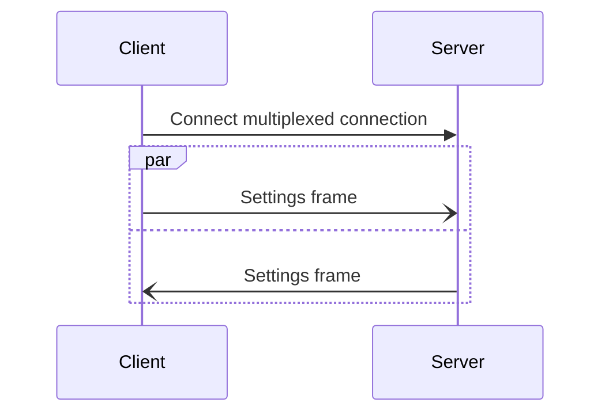

## Connection establishment steps

The icerpc connection establishment is the same for a client creating a connection and for a server accepting a
connection, except for the very first step:

1. (client only) Create a multiplexed connection to the server.

    (server only) Accept a multiplexed connection from a client.

2. Connect the multiplexed connection. This connect operation is transport-dependent and can be no-op.

3. Open a unidirectional stream to the peer in the connected multiplexed connection: the outbound control stream.

4. Accept a unidirectional stream from the peer: the inbound control stream.

5. Send the `Settings` frame to the peer over the outbound control stream.
The client and server typically send this `Settings` frame to each other at about the same time.

6. Receive the `Settings` frame from the peer over the inbound control stream.

Once the client or the server receives the `Settings` frame from the peer, it considers the connection to be established
and the local application code can start sending requests (creating streams) and dispatching requests (accepting
streams) on this connection.

The following sequence diagram shows the interactions between the client and server on connection establishment:



## Settings frame

The `Settings` frame is used to configure an icerpc connection during connection establishment. Each side of the
connection must send a `Settings` frame and wait until it receives a `Settings` frame from the peer; there is however no
requirement to specify any setting.

There is currently only one setting, `MaxHeaderSize`. It specifies the maximum size of the header of a request or
response sent over this connection.

Not specifying the `MaxHeaderSize` setting is equivalent to specifying its default value, 16,383. This default value
allows to encode the size of request and response headers on no more than 2 bytes.

If a client or a server does not want to use this default value, it sends its desired value to the peer in the
`Settings` frame. This tells the peer: "I only accept frames with a header up to this size". It is uncommon to change
this setting.

The `Settings` frame is specified in [Slice][slice]:

```slice
enum ControlFrameType : uint8 {
    Settings = 0
    GoAway = 1
}

compact struct SettingsFrame {
    type: ControlFrameType // value is ControlFrameType::Settings
    bodySize: varuint62    // the number of bytes in body
    body: dictionary<SettingKey, varuint62>
}

unchecked enum SettingKey : varuint62 {
    MaxHeaderSize = 0
}
```

[slice]: ../../slice2
