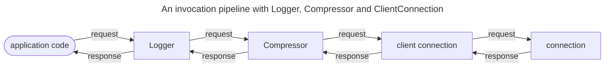

## Intercepting outgoing requests

An interceptor is an [invoker](invocation-pipeline#the-invoker-abstraction) that holds another invoker ("next") and
calls `invoke` on this next invoker as part of the implementation of its own `invoke` method. This next invoker can be a
 client connection, a connection cache`, another interceptor, or some other kind of invoker, it doesn't matter.

An interceptor can include logic before calling `invoke` on the next invoker (before the request is sent) and after
calling `invoke` on the next invoker (after it receives the response). An interceptor can also short-circuit the
invocation pipeline by throwing an exception or returning a cached response.

For example, a simple C# interceptor could look like:

```csharp
public class SimpleInterceptor : IInvoker
{
    private readonly IInvoker _next;

    public SimpleInterceptor(IInvoker next) => _next = next;

    public async Task<IncomingResponse> InvokeAsync(OutgoingRequest request, CancellationToken cancellationToken)
    {
        Console.WriteLine("before _next.InvokeAsync");
        IncomingResponse response = await _next.InvokeAsync(request, cancellationToken);
        Console.WriteLine($"after _next.InvokerAsync; the response status code is {response.StatusCode}");
        return response;
    }
}
```

## Installing an interceptor

In C#, you can create an invocation pipeline by creating an instance of class [Pipeline] and then calling `Use{Name}`
extension methods to install interceptors on this pipeline.

For example:

```csharp
Pipeline pipeline = new Pipeline()
    .UseLogger(loggerFactory)
    .UseCompressor()
    .Into(clientConnection);
```

You need to specify the last invoker of the pipeline with `Into`. It's usually a client connection or a connection
cache, but it can also be another pipeline since `Pipeline` is itself an invoker.

When you make an invocation on a pipeline, the request goes through this chain of invokers. On the way back, the
incoming response goes through the same chain of invokers in reverse order.



The order in which you install these interceptors is often important. The first interceptor you install is the first
interceptor to execute. With the pipeline we created above, the logger interceptor executes first, then calls
`InvokeAsync` on the compressor interceptor, and then finally the compressor interceptor calls `InvokeAsync` on the
client connection.

[Pipeline]: csharp:IceRpc.Pipeline
