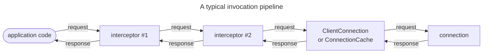

## Definition

The process of sending a request and receiving the corresponding response is called an invocation.

You would typically make invocations over client connections. Nevertheless, since client and server
[connections][connections] have the same capabilities, you can also make invocations the other way around, from the
server-side of a connection to the client-side of this connection.

## The Invoker abstraction

With IceRPC, you always make an invocation by calling an invoker. An invoker is a simple abstraction that accepts an
[outgoing request](outgoing-request) and returns an [incoming response](incoming-response).

In C#, this abstraction is the [IInvoker][invoker-interface] interface:

```csharp
namespace IceRpc;

public interface IInvoker
{
    Task<IncomingResponse> InvokeAsync(OutgoingRequest request, CancellationToken cancellationToken = default);
}
```

Both [ClientConnection][client-connection] and [ConnectionCache][connection-cache] implement this interface. This
allows you to make an invocation by creating a client connection or a connection cache and then calling
[InvokeAsync][invoke-async] on the resulting instance:

```csharp
await using var clientConnection = new ClientConnection(new Uri("icerpc://hello.zeroc.com"));
using var request = new OutgoingRequest(...);

// Make an invocation by calling the IInvoker.InvokeAsync method implemented by ClientConnection.
IncomingResponse response = await clientConnection.InvokeAsync(request);
```

## Invocation processing

It is common to perform additional processing on an invocation before giving it to a connection. For example, you may
want to compress the payloads of your requests, add a telemetry field to each request, add a deadline, or simply add
logging.

An invoker implementation can call on another invoker, which itself calls on another invoker, and so on; the invoker
used to make an invocation can be the head of an invoker chain or tree, known as an "invocation pipeline".

There are 3 common types of invokers:

- **Leaf invoker**\
   It's a leaf in the invocation pipeline. This leaf invoker is typically a connection.

- **Interceptor**\
    An [interceptor](interceptor) intercepts an invocation and forwards it to the "next" interceptor. IceRPC provides
    several built-it interceptors for logging, compression and more.

- **Pipeline**\
    A [pipeline](invocation-pipeline) walks a request through interceptors registered with this pipeline before giving
    the request to a leaf invoker.



[client-connection]: csharp:IceRpc.ClientConnection
[connections]: ../connection/how-to-create-a-connection
[connection-cache]: csharp:IceRpc.ConnectionCache
[invoke-async]: csharp:IceRpc.IInvoker#IceRpc_IInvoker_InvokeAsync_IceRpc_OutgoingRequest_System_Threading_CancellationToken_
[invoker-interface]: csharp:IceRpc.IInvoker
