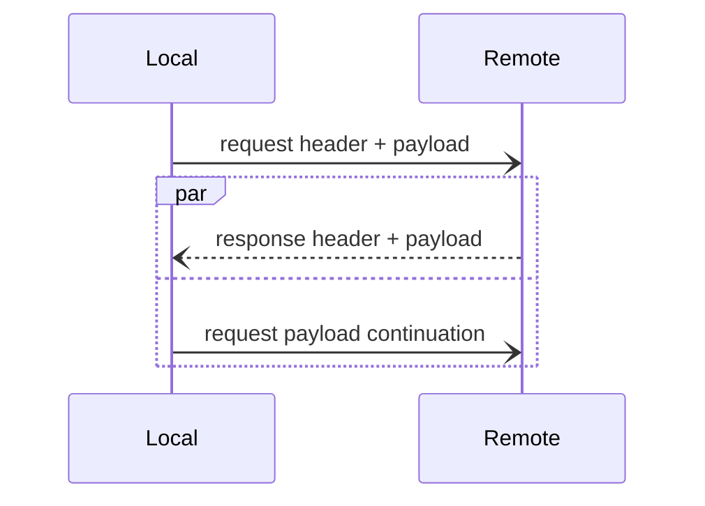

## Creating an outgoing request

In order to make an RPC, you construct an outgoing request and then pass this request as a parameter to the `invoke`
method of an [invoker](invocation-pipeline#the-invoker-abstraction).

An outgoing request carries all the information an invoker needs to send a request:
- the [service address](service-address) of the target service
- the name of the operation to call on this service
- request [fields](#request-fields)
- the [payload](#request-payload-and-payload-continuation) of the request

An outgoing request also holds [features](#request-features). These features are used for local communications within
this pipeline; they are also used for communications between invokers in the pipeline and your application code.

## Request fields

The request fields represent out-of-band information carried by a request "over the wire". These fields are usually read
and written by [interceptors](interceptor) and [middleware] in an effort to coordinate the processing of the same
request in the client and in the server.

A field is an entry in a dictionary `RequestFieldKey` to sequence of bytes, where [RequestFieldKey] is an enumeration
defined in Slice:

```slice
unchecked enum RequestFieldKey : varuint62 {
    Context = 0
    TraceContext = 1
    CompressionFormat = 2
    Deadline = 3
    Idempotent = 4
}
```

For example, when the compressor interceptor compresses the payload of an outgoing request, it sets the request field
[CompressionFormat]. This tells the compressor middleware on the other side of the connection "this payload is
compressed with brotli"; the compressor middleware can then decompress this (incoming) request payload.

## Request payload and payload continuation

The payload of a request is a stream of bytes that represents the argument(s) of an operation. When a connection sends a
request, it reads and logically copies these bytes to the network connection until there is no more byte to read.

On the other side, the connection reads these bytes from the network, creates an incoming request and gives this request
to a [dispatcher].

The payload of an outgoing request is actually split in two: a first part that the connection sends before awaiting the
response, and a second part (the "continuation") that the connection sends in the background while it awaits, receives
and returns the response.



On the other side, the dispatcher sees only a single continuous incoming request payload.

## Request features

It is common for the invokers in an invocation pipeline to transmit information to each other during an invocation. For
example, the retry interceptor needs to communicate with the connection cache to make sure the connection cache does not
keep retrying with the same server address. In C#, these invokers get and set the request's [IFeatureCollection] to
communicate with each other.

You can also use these features to communicate with the invocation pipeline. For example, you can set the feature
[ICompressFeature] to ask the compressor interceptor (if installed) to compress the payload of your request:

```csharp
using var request = new OutgoingRequest(serviceAddress)
{
    Payload = largePayload,
    Features = new FeatureCollection().With<ICompressFeature>(CompressFeature.Compress)
};

// Hopefully invoker is an invocation pipeline with a compressor interceptor.
IncomingResponse response = await invoker.InvokeAsync(request);
```

By convention, the features are keyed using interface types, such as `ICompressFeature` in the example above.


Fields are used for communications "over the wire" while features are used for local communications within an invocation
pipeline. IceRPC provides both request fields (carried by requests) and response fields (carried by responses), but
only request features: since it's all local, there is no need for response features.


[middleware]: ../dispatch/middleware
[dispatcher]: ../dispatch/dispatch-pipeline#the-dispatcher-abstraction

[RequestFieldKey]: https://github.com/icerpc/icerpc-slice/blob/main/IceRpc/RequestFieldKey.slice
[CompressionFormat]: https://github.com/icerpc/icerpc-slice/blob/main/IceRpc/CompressionFormat.slice

[IFeatureCollection]: csharp:IceRpc.Features.FeatureCollection
[ICompressFeature]: csharp:IceRpc.Features.ICompressFeature
