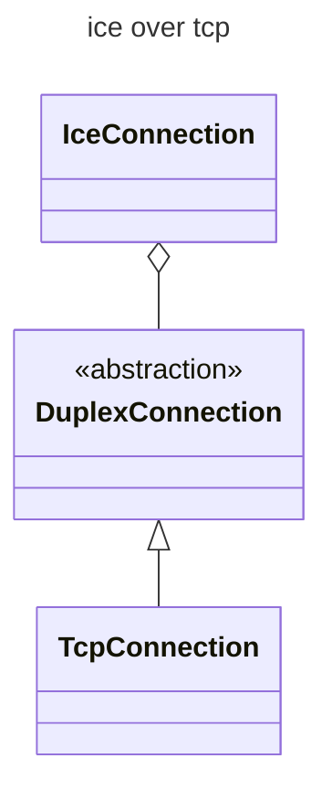
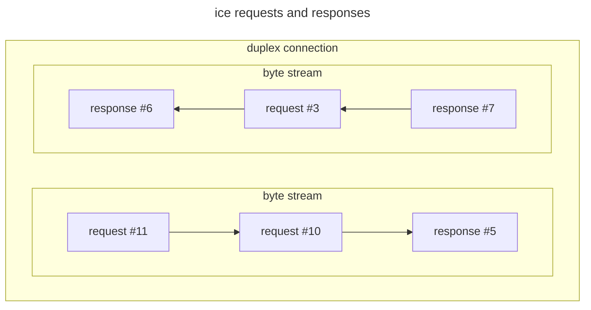

## The ice protocol

When you create a client connection to server address `ice://hello.zeroc.com`, you instruct IceRPC to establish a
connection that uses the ice protocol.

ice is an [application layer][application-layer] protocol that transmits RPCs (requests and responses) over a duplex
connection.


We always spell ice in lowercase when discussing the ice protocol. This avoids confusion with the
[Ice](https://github.com/zeroc-ice/ice) platform.

The ice protocol is provided for interoperability with applications built with Ice. You should use
[icerpc](icerpc-multiplexed-transports) if you don't need interop with Ice-based applications.


## Duplex transport

The [duplex transport][duplex-transport] page describes an abstraction for a traditional transport like TCP or
[RFCOMM][rfcomm]. It creates duplex (transport) connections. A duplex connection provides two byte streams: one from the
client to the server, and another from the server to the client.

An ice connection runs over a duplex connection.

The ice protocol sends requests and responses over a duplex connection by writing requests and responses one after
the other. Each request or response is always fully written: when you send a request or response with ice, the sending
of another request or response in the same direction will wait until after this request or response is fully written.

This serialization can result in [head-of-line blocking](https://en.wikipedia.org/wiki/Head-of-line_blocking).

If you send requests and responses concurrently over the same ice connection, make sure that all these requests and
responses are fairly small. And if you can't avoid sending large requests or responses, you should consider creating a
separate ice connection dedicated to these large requests or responses.

## Limitations of the ice protocol

The following IceRPC features are not available with the ice protocol:

- [payload continuations](../invocation/invocation-pipeline#payload-and-payload-continuation)
- [request fields](../invocation/outgoing-request#request-fields) other than Context and Idempotent
- [response fields](../invocation/incoming-response#response-fields)
- [status codes](../invocation/incoming-response#status-code) other than Success, ApplicationError, ServiceNotFound,
OperationNotFound and UnhandledException

[application-layer]: https://en.wikipedia.org/wiki/Application_layer
[duplex-transport]: ../customization/duplex-transport.md
[rfcomm]: https://en.wikipedia.org/wiki/List_of_Bluetooth_protocols#Radio_frequency_communication_(RFCOMM)
