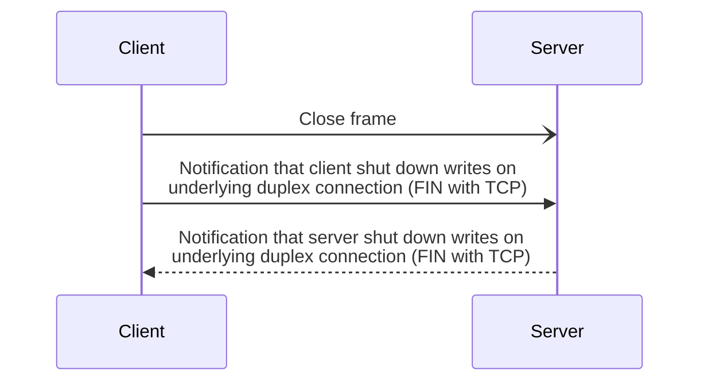
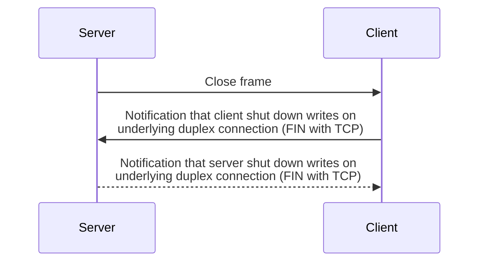

A client or a server can close a connection, and this closure can be either graceful or abortive.

Once the closure of a connection is initiated, all the streams are closed. The client and the server no longer send
[StreamReadsClosed] and [StreamWritesClosed] frames on this connection.

## Graceful connection closure

A client closes the connection as follows:

1. Send a [Close] frame to the server.

2. Shut down writes on the underlying duplex connection.

3. Wait for server to shut down writes on the underlying duplex connection.

The client considers the connection closed when it receives the notification that the server has shut down writes on the
underlying duplex connection.

The following sequence diagram shows the interactions between the client and server when the connection closure is
initiated by the client:

A server closes the connection as follows:

1. Send a `Close` frame to the client.

2. Wait for client to shut down writes on the underlying duplex connection.

3. Shut down writes on the underlying duplex connection.

The server considers the connection closed when it receives the notification that the client has shut down writes on the
underlying duplex connection.

The following sequence diagram shows the interactions between the client and server when the connection closure is
initiated by the server:


It's the client—and never the server—that is the first to shut down writes on its side of the underlying duplex
connection. When using the TCP transport, this ensures sockets won't be left in the TIME_WAIT state on the server.


The `Close` frame carries an application error code. This error code provides the reason for the connection closure.

## Abortive connection closure

An abortive connection closure aborts the underlying duplex connection.

[Close]: protocol-frames#close-frame
[StreamReadsClosed]: protocol-frames#streamreadsclosed-and-streamwritesclosed-frames
[StreamWritesCosed]: protocol-frames#streamreadsclosed-and-streamwritesclosed-frames
