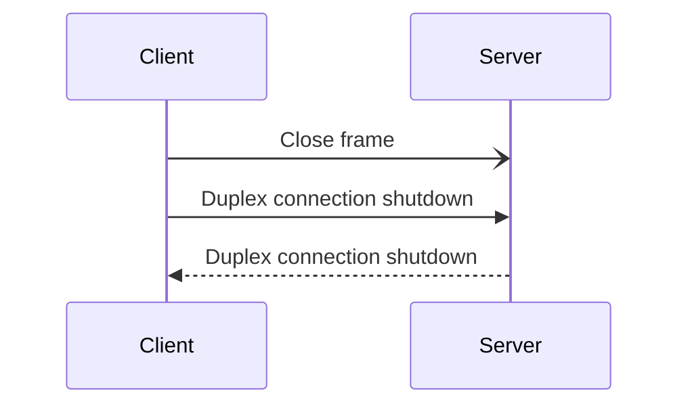
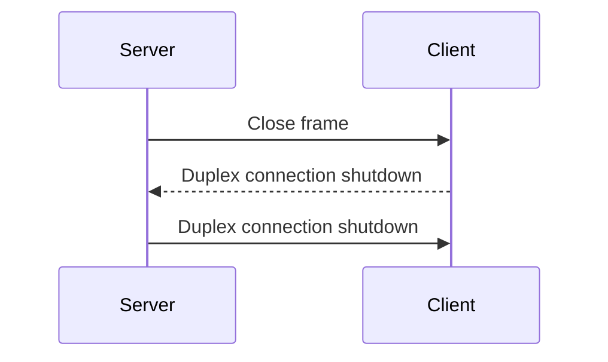

## What's connection closure?

Connection closure is either graceful or abortive and can be initiated by the client or server. Violations of the
protocol lead to an abortive close.

Once the connection closure is initiated, neither the client nor the server sends
[StreamReadsClosed][stream-reads-closed-frame] and [StreamWritesClosed][stream-writes-closed-frame] frames. The
application must consider the streams as immediately closed.

## Graceful connection closure

A client closes the connection as follows:

1. Send a [Close][close-frame] frame to the server.

2. Shut down writes on the underlying duplex connection.

3. Wait for server to shut down writes on the underlying duplex connection.

The client considers the connection closed when it receives the notification that the server has shut down writes on the
underlying duplex connection.

The following sequence diagram shows the interactions between the client and server when the connection closure is
initiated by the client:

A server closes the connection as follows:

1. Send a Close frame to the client.

2. Wait for client to shut down writes on the underlying duplex connection.

3. Shut down writes on the underlying duplex connection.

The server considers the connection closed when it receives the notification that the client has shut down writes on the
underlying duplex connection.

The following sequence diagram shows the interactions between the client and server when the connection closure is
initiated by the server:


The difference between the client and the server connection closure is the timing of the duplex connection writes
shutdown. The duplex connection writes shutdown is always first initiated by the client. When using the TCP transport,
this ensures sockets won't be left in the TIME_WAIT state on the server.


The Close frame carries an application error code. This error code provides the reason for the connection closure.

## Abortive connection closure

Abortive connection closure must abort the duplex connection.

[close-frame]: protocol-frames#close-frame
[stream-reads-closed-frame]: protocol-frames#streamreadsclosed-and-streamwritesclosed-frames
[stream-writes-closed-frame]: protocol-frames#streamreadsclosed-and-streamwritesclosed-frames
