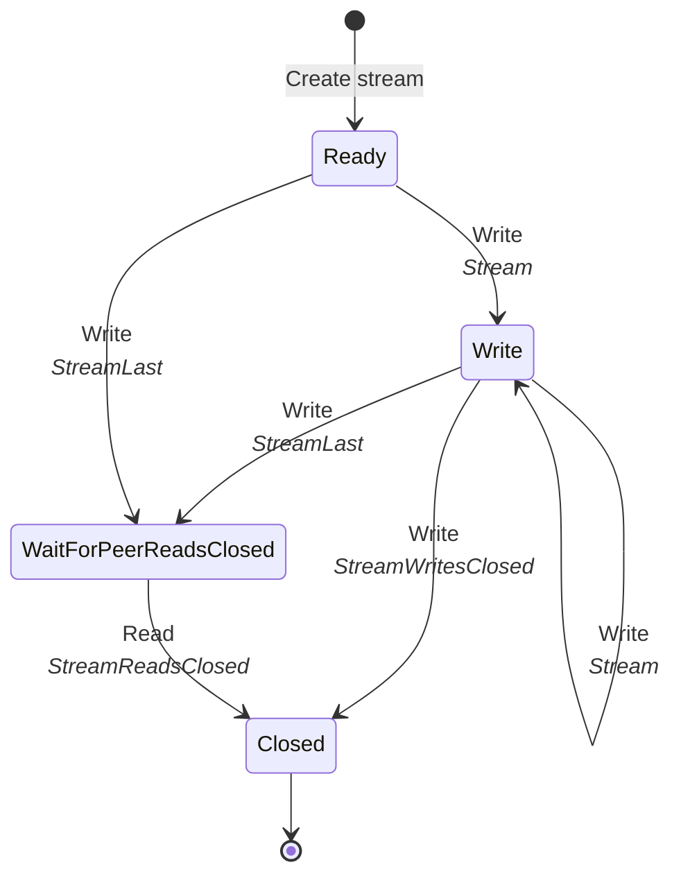
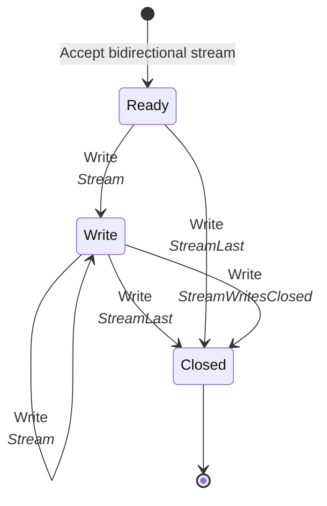
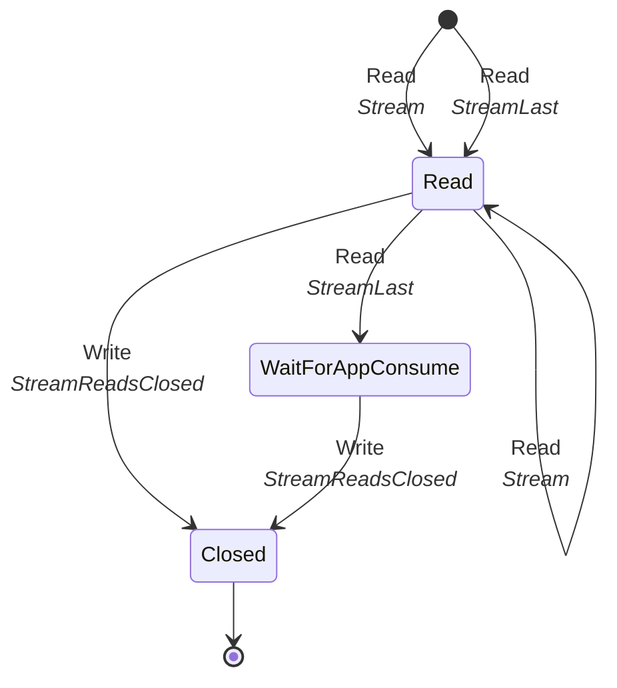
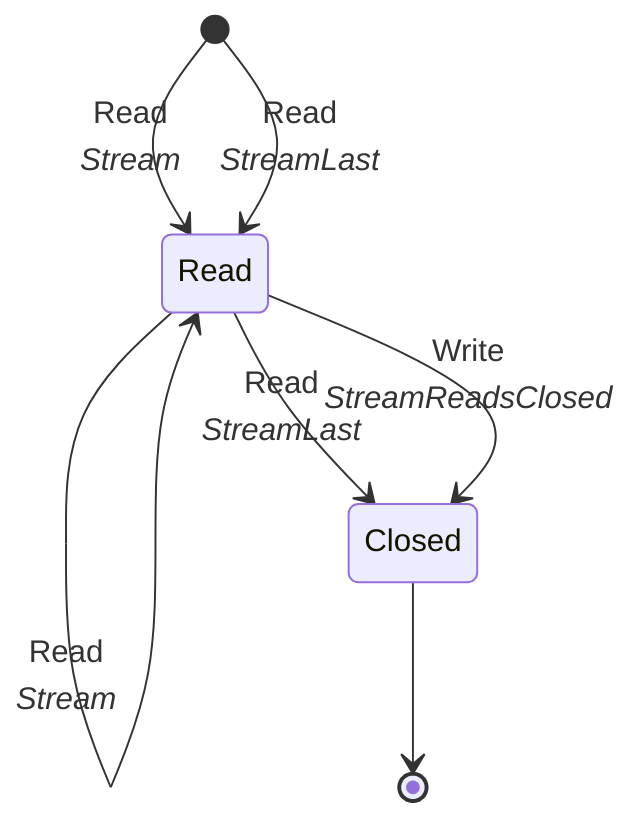

## What is a stream?

Data is transmitted through independent bidirectional or unidirectional streams. Unidirectional streams carry data from
the initiator of the stream to the peer. Data can be transmitted in both directions of a bidirectional stream. Multiple
streams can be opened at the same time on a multiplexed connection. Streams are identified by an ever increasing 62-bit
integer.

Slic stream identifiers are similar to QUIC, see [RFC9000][rfc9000]. The first least significant bit of a stream
identifier specifies if the initiator is the client or the server. The second least significant bit specifies if the
stream is bidirectional or unidirectional. The following table summarizes the four stream types:

| Bits | Stream Type                      |
| ---- | -------------------------------- |
| 0x00 | Client-Initiated, Bidirectional  |
| 0x01 | Server-Initiated, Bidirectional  |
| 0x02 | Client-Initiated, Unidirectional |
| 0x03 | Server-Initiated, Unidirectional |

The following table describes stream-specific frames:

| Frame Type         | Description                                                                   |
| ------------------ | ----------------------------------------------------------------------------- |
| Stream             | Carries application data.                                                     |
| StreamLast         | Carries application data and informs the peer that no more data will be sent. |
| StreamReadsClosed  | Informs the peer of the stream reads closure.                                 |
| StreamWritesClosed | Informs the peer of the stream writes closure.                                |
| StreamWindowUpdate | Informs the peer of a stream window update.                                   |

## Stream creation

Sending a [Stream][stream-frame] or [StreamLast][stream-last-frame] frame with a newly allocated stream identifier
creates the stream. Sending another stream frame with a newly allocated stream identifier is a protocol error.

The peer accepts a new stream when it receives a `Stream` or `StreamLast` frame with a stream identifier larger than the
last accepted stream identifier.

The stream identifier must be the next expected stream identifier. For example, if the last stream accepted by the
server is the bidirectional stream with the identifier 0, the identifier of the next accepted bidirectional stream must
be 4.

## Stream closure

Each side of a stream maintains a reads and writes closed state. When the application is done writing data on a stream,
it closes writes on the stream. When it's done reading data, it closes reads.

The update of the closed state triggers the sending of one of the following frames:

- Slic sends a [StreamWritesClosed][stream-writes-closed-frame] frame to the peer when the application closes writes on
  the stream. Upon receiving this frame, the peer stops reading data from the stream and close the stream reads.

- Slic sends a [StreamReadsClosed][stream-reads-closed-frame] frame to the peer when the application closes writes on
  the stream. Upon receiving this frame, the peer stops sending data over the stream and close the stream writes.

A stream is considered closed when both writes and reads are closed.

## Sending and receiving data over a stream

The `Stream` and `StreamLast` frames cary a sequence of bytes provided by the application. Multiple `Stream` frames can
be sent over the Slic connection for a specific stream. They will be received in order by the peer. The `StreamLast`
frame cary the last sequence of bytes delivered to the peer. Upon receiving this frame, the peer can assume that no more
data will be sent for this stream.

Sending a `Stream` frame after a `StreamLast` frame or multiple `StreamLast` frames for the same stream is considered a
protocol error.

The [MaxStreamFrameSize][connection-parameters] parameter limits the maximum size of a `Stream`` or `StreamLast` frame. If
the application data is larger than this parameter value, the data is sent in chunks with multiple `Stream` frames.
Frames are serialized on the underlying duplex connection so sending a frame delays the sending of other frames.
Reducing the maximum stream frame size reduces this delay. It's in particular useful when dealing with slow connections.

## Stream states

A stream has two separate state machines: one for its write-side and one for its read-side.

The state machines also depend on the type of the stream. The type of a stream is defined as follows:
- a local stream is a stream created by the application
- a remote stream is a stream accepted by the application

A local stream doesn't have the same read or write state machine as a remote stream. As we will see below, different
state machines are required for controlling [stream concurrency][stream-concurrency].

### Write-side states

The following state diagram shows the write state machine of a local stream:

The write-side is initially in the `Ready` state. In this state, the stream is ready to accept data from the
application. The write-side enters the `Write` state when the application starts writing data. When the write-side is in
the `Write` state, Slic can send `Stream` or `StreamLast` frames on that stream to carry the application data.

The write-side exits the `Write` state to enter the `WaitForPeerReadsClosed` state when the application indicates that
no more data will be written. Once it gets this notification from the application, the write-side sends a StreamLast
frame to notify the peer.

In the `WaitForPeerReadsClosed` state, the write-side waits for the peer to consume all the data. This is required to
keep track of the number of matching remote streams opened on the peer. The application can't open a new stream if the
remote stream count reached `MaxBidirectionalStreams` or `MaxUnidirectionalStreams` (these parameters are provided by
the peer on [connection establishment][connection-parameters]). The peer sends the `StreamReadsClosed` frame once it
consumed all the data. The write-side enters the `Closed` state when the stream receives this frame.

If the application closes writes, the write-side enters directly the `Closed` state and sends the `StreamWritesClosed`
frame to notify the peer of the writes closure.

The following state diagram shows the write state machine of a remote bidirectional stream (a remote unidirectional
stream doesn't have a write-side):

The state machine doesn't have the `WaitForPeerReadsClosed` state because the stream's write-side doesn't need to wait
for the peer to consume all the data.

### Read-side stream states

The following state diagram shows the read state machine of a remote stream:

The application accepts a remote stream following the reading of a `Stream` or `StreamLast` frame on the connection. The
read-side of the stream is initially in the `Read` state. In this state the stream buffers the data received from the
peer.

The read-side enters the `WaitForAppConsume` state when the peer notifies the stream that no more data will be sent
(with the `StreamLast` frame). In this state, the read-side waits for the application to consume all the buffered data.
Once the application consumed all the data, the read-side enters the `Closed` state and sends the `StreamReadsClosed`
frame.

If the application closes reads, the read-side enters directly the `Closed` state and sends the `StreamReadsClosed`
frame to notify the peer of the reads closure.

The following state diagram shows the read state machine of a local bidirectional stream (a local unidirectional stream
doesn't have a read-side):

The state machine doesn't have the `WaitForAppConsume` state because the stream's read-side doesn't need to notify the
peer that its done reading.

[rfc9000]: https://www.rfc-editor.org/rfc/rfc9000.html#name-stream-types-and-identifier
[connection-parameters]: connection-establishment#connection-establishment-parameters
[stream-frame]: protocol-frames#stream-and-streamlast-frames
[stream-last-frame]: protocol-frames#stream-and-streamlast-frames
[stream-reads-closed-frame]: protocol-frames#streamreadsclosed-and-streamwritesclosed-frames
[stream-writes-closed-frame]: protocol-frames#streamreadsclosed-and-streamwritesclosed-frames
[stream-window-update-frame]: protocol-frames#streamwindowupdate-frame
[stream-concurrency]: flow-control#stream-concurrency