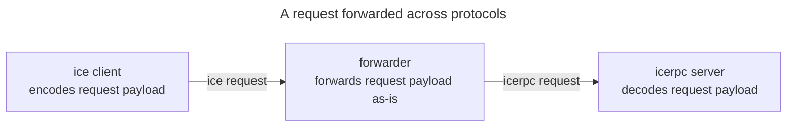

## Compact binary encoding

The Slice encoding defines how each Slice language construct is encoded into a stream of bytes. It's a non-self
describing binary encoding: the Slice encoding relies on the encoder and decoder sharing the same contract (Slice
definitions) to achieve compactness.

For example:

```slice
compact struct Item {
    name: string
    count: int32
}
```

The encoder encodes a `string` followed by an `int32` into a stream of bytes. Later on, a decoder decodes these bytes.
Since the decoder has the same definitions, it expects the stream to hold an encoded `string` followed by an
encoded `int32`. The stream does not encode "the following bytes represent a string". If the byte stream holds some
other encoded type, the decoding fails.

## Protocol independent

The Slice encoding is ultimately about encoding and decoding the payloads of IceRPC requests and responses, and the
encoding could consider the protocol of the request / response (ice or icerpc) to be part of the contract between the
encoder and the decoder.

However, this approach would not work when an intermediary forwards requests across protocols, as in:



As a result, the Slice encoding is protocol-independent.

## Little-endian

When encoding integers and floating point numbers into multiple bytes, we have to select a byte ordering:
[little-endian or big-endian](https://en.wikipedia.org/wiki/Endianness).

All modern CPUs are little-endian, while the standard endianness for network protocols is big-endian.

We use Slice to encode/decode application data into/from request and response payloads. This application data typically
transits from one little-endian system to another little-endian system, so little-endian is simpler and slightly faster
for this use-case: it allows us to keep the native endianness on most systems.

On the other hand, the ice and icerpc protocols define their frame headers and control frames using Slice; this usage
favors big-endian ordering.

We selected little-endian because Slice's main job is to encode/decode the payloads of requests and responses. Its use
for the ice and icerpc frame headers is secondary. And it's simpler to use the same ordering (little-endian) in all
situations.
