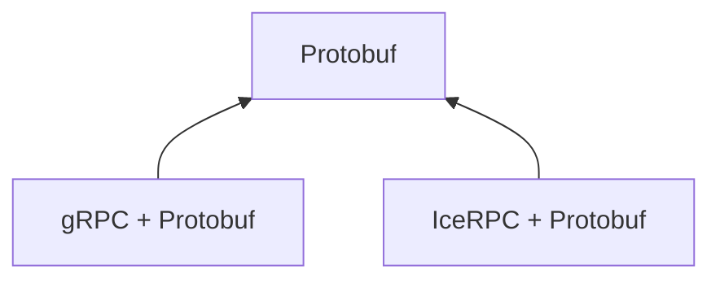
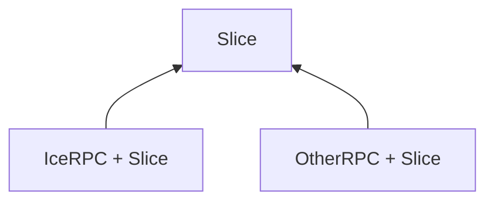

IceRPC provides everything you need to make RPCs. When you use only IceRPC's core API, the payload of your requests
and responses are streams of bytes, and you need to manually encode and decode any typed data (such as strings and
integers) in these streams. This is doable but laborious.

It is easier and more typical to use IceRPC together with a serialization library and its associated language-neutral
[IDL][idl]. For example, you can define a Person type in [Protobuf][protobuf] or Slice and then let the Protobuf
compiler resp. the Slice compiler generate code that encodes and decodes Person to and from bytes in the Protobuf resp.
Slice binary format.




```protobuf
// A Person message defined with Protobuf

syntax = "proto3";

message Person {
  string name = 1;
  int32 id = 2;
  string email = 3;
}
```

```slice
// A Person class defined with Slice

class Person {
   name: string
   id: int32
   tag(1) email: string?
}
```






```protobuf
// A Person message defined with Protobuf

syntax = "proto3";

message Person {
  string name = 1;
  int32 id = 2;
  string email = 3;
}
```

```slice
// A Person struct defined with Slice

struct Person {
   name: string
   id: int32
   tag(1) email: string?
}
```



The Slice language, like the Protobuf language, includes RPC support without being tied to a specific RPC framework. It
specifies the syntax and semantics for RPCs but leaves the actual implementation of this RPC support to external
integrations:









For example, the Thermostat interface below defines 3 operations, or RPCs, in Slice:

```slice
interface Thermostat {
   getCurrentTemperature() -> float64
   getHistoricalTemperature(timeStamp: WellKnownTypes::TimeStamp) -> float64
   streamTemperature() -> stream float64
}
```

The Slice compiler augmented by the IceRPC + Slice integration parses this Slice interface and generates code in the
programming language of your choice. The resulting generated code offers you a convenient typed RPC API implemented
using IceRPC requests and responses.

















[icerpc]: ../
[idl]: https://en.wikipedia.org/wiki/Interface_description_language
[protobuf]: https://protobuf.dev/
